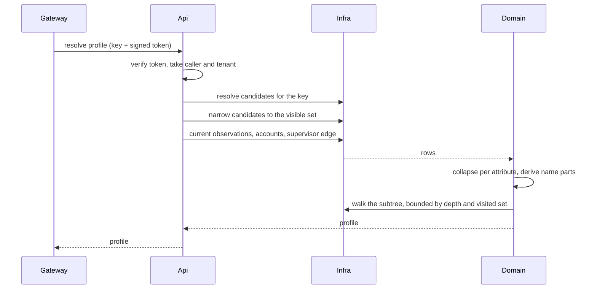
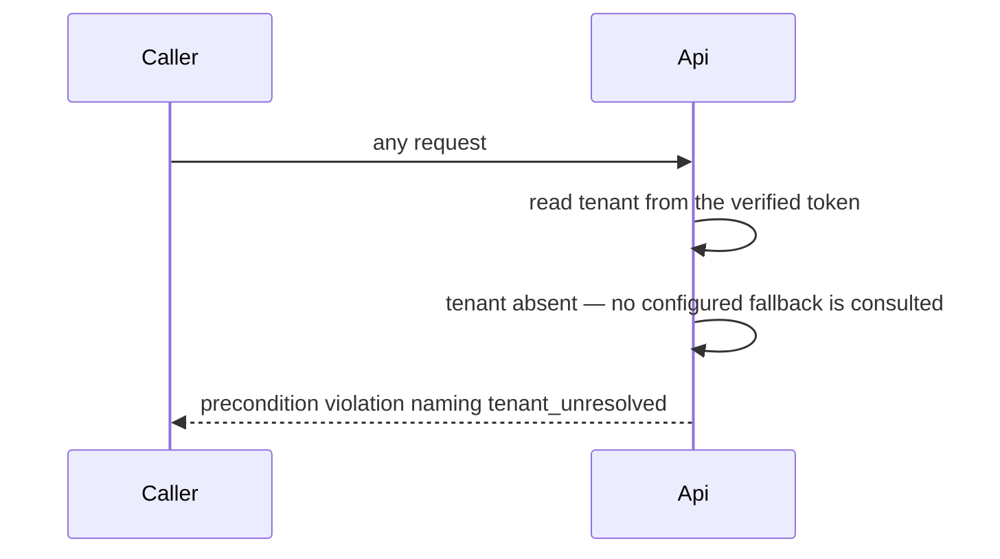
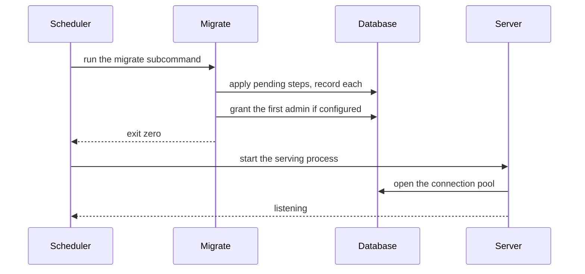
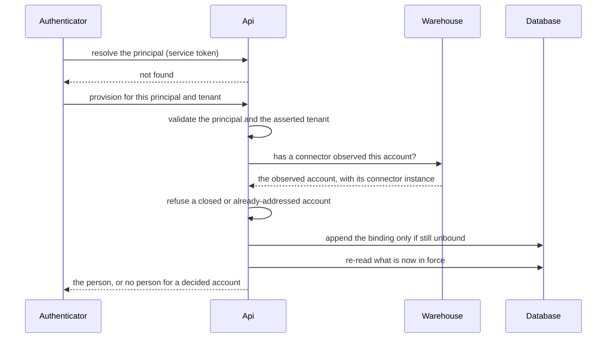
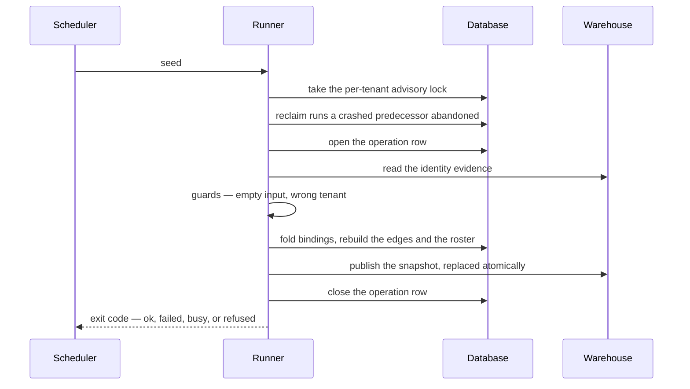
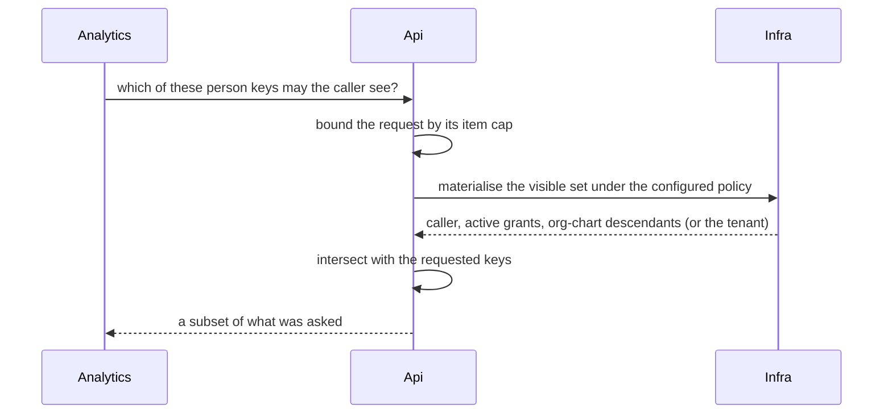

# Technical Design — Identity Resolution Service

- [ ] `p3` - **ID**: `cpt-insightspec-design-identity-service`

<!-- toc -->

- [1. Architecture Overview](#1-architecture-overview)
  - [1.1 Architectural Vision](#11-architectural-vision)
  - [1.2 Architecture Drivers](#12-architecture-drivers)
  - [1.3 Architecture Layers](#13-architecture-layers)
- [2. Principles & Constraints](#2-principles--constraints)
  - [2.1 Design Principles](#21-design-principles)
  - [2.2 Constraints](#22-constraints)
- [3. Technical Architecture](#3-technical-architecture)
  - [3.1 Domain Model](#31-domain-model)
  - [3.2 Component Model](#32-component-model)
  - [3.3 API Contracts](#33-api-contracts)
  - [3.4 Internal Dependencies](#34-internal-dependencies)
  - [3.5 External Dependencies](#35-external-dependencies)
  - [3.6 Interactions & Sequences](#36-interactions--sequences)
  - [3.7 Database schemas & tables](#37-database-schemas--tables)
- [4. Additional context](#4-additional-context)
  - [4.1 Configuration surface](#41-configuration-surface)
  - [4.2 Logging shape](#42-logging-shape)
- [5. Traceability](#5-traceability)

<!-- /toc -->

## 1. Architecture Overview

### 1.1 Architectural Vision

The service is a Rust gear on the shared service host, in the same shape as the
analytics service: the host owns the listener, the token verification, the
configuration layering, the generated interface document and the log pipeline;
this crate contributes a route table, a domain layer and a persistence layer.
It is not a read-only lookup — it serves reads, accepts operator writes, and
ships two batch entry points that run as their own processes.

Every current fact it reports is **derived per request** from an append-only
journal rather than stored as a mutable field. There is no cache of the journal
anywhere in the process. That single choice explains most of the design: a
correction is visible on the next request with nothing to invalidate; the
memory budget is a function of concurrency rather than of organisation size;
and the cost of an answer is a small number of indexed queries plus, where the
caller asked for it, a bounded tree walk.

Three rules hold the surface together. **One visibility derivation** backs the
profile gate, the batch filter, the roster, the picker and the org-chart reads,
so no two surfaces can disagree about who may see whom. **One error model** —
the host's canonical problem envelope — carries every refusal, so consumers
branch on a stable shape rather than on per-endpoint conventions. **One journal
of record** receives the seed's writes, the operator's corrections and the
login bootstrap's mints alike, so history is reconstructible regardless of which
path produced a fact.

### 1.2 Architecture Drivers

Architecture-shaping decisions are captured as ADRs in [`ADR/`](ADR/):

- [`cpt-insightspec-adr-0002-read-from-mariadb-persons`](ADR/0002-read-from-mariadb-persons.md) — read the relational journal, not the warehouse.
- [`cpt-insightspec-adr-0003-latest-per-source-semantics`](ADR/0003-latest-per-source-semantics.md) — latest-per-source projection semantics.
- [`cpt-insightspec-adr-0004-lowercase-email-lookup`](ADR/0004-lowercase-email-lookup.md) — lowercase addresses on write and lookup (**superseded by ADR-0011**).
- [`cpt-insightspec-adr-0005-tenant-context-strategy`](ADR/0005-tenant-context-strategy.md) — where the tenant comes from.
- [`cpt-insightspec-adr-0006-display-name-split-fallback`](ADR/0006-display-name-split-fallback.md) — derive name parts from a display name.
- [`cpt-insightspec-adr-0007-value-type-routing`](ADR/0007-value-type-routing.md) — routing a value to its storage column by kind.
- [`cpt-insightspec-adr-0008-bamboohr-identity-inputs-extension`](ADR/0008-bamboohr-identity-inputs-extension.md) — the attribute set the HR evidence model emits.
- [`cpt-insightspec-adr-0009-post-profile-with-uniqueness-invariant`](ADR/0009-post-profile-with-uniqueness-invariant.md) — a structured lookup body with a single-result invariant (its wire mapping superseded by ADR-0016).
- [`cpt-insightspec-adr-0010-org-chart-cache`](ADR/0010-org-chart-cache.md) — the materialised reporting-edge cache.
- [`cpt-insightspec-adr-0011-persons-relax-uniqueness-and-collation`](ADR/0011-persons-relax-uniqueness-and-collation.md) — record state transitions; compare identifiers case-insensitively.
- [`cpt-insightspec-adr-0012-admin-only-orgchart-visibility-reads`](ADR/0012-admin-only-orgchart-visibility-reads.md) — admin-only reads on the grant tables.
- [`cpt-insightspec-adr-0013-roles-hard-delete-with-in-use-guard`](ADR/0013-roles-hard-delete-with-in-use-guard.md) — hard delete of a role behind an in-use guard (its wire mapping superseded by ADR-0016).
- [`cpt-insightspec-adr-0014-last-admin-protection`](ADR/0014-last-admin-protection.md) — refuse the last admin revoke.
- [`cpt-insightspec-adr-0015-self-scoped-visibility-read-without-admin`](ADR/0015-self-scoped-visibility-read-without-admin.md) — the caller's own visible set needs no admin role.
- [`cpt-insightspec-adr-0016-canonical-errors-and-conflict-status`](ADR/0016-canonical-errors-and-conflict-status.md) — the canonical error envelope, and conflict as the status for a violated data invariant.
- [`cpt-insightspec-adr-0017-visibility-policy-configuration`](ADR/0017-visibility-policy-configuration.md) — tenant-wide visibility as a configured policy, not as issued grants.
- [`cpt-insightspec-adr-0018-roster-minted-login-identity`](ADR/0018-roster-minted-login-identity.md) — minting a person at login from an observed roster account, over separate single-question routes.

#### Functional Drivers

| Requirement | Design Response |
|-------------|-----------------|
| [`cpt-insightspec-fr-identity-caller-identified`](PRD.md#every-request-answers-to-the-callers-token) | The host's authentication plugin verifies the signed gateway token and maps its claims into a request-scoped security context; `api::gate::require_caller` reads the subject and tenant from it. No handler accepts a caller identity from the request itself. |
| [`cpt-insightspec-fr-identity-lookup-400-tenant`](PRD.md#an-unresolved-tenant-is-refused-never-defaulted) | `require_caller` rejects a nil tenant with a precondition violation naming `tenant_unresolved`. `tenant_default_id` is read only by the batch runners and the first-admin bootstrap — no request path consults it. |
| [`cpt-insightspec-fr-identity-admin-gate`](PRD.md#operator-surfaces-require-an-active-admin-role) | `api::gate::require_admin` calls `roles_repo::has_active_role` per request against the caller's tenant. Missing subject is unauthenticated; present subject without the grant is permission-denied. |
| [`cpt-insightspec-fr-identity-service-principal-gate`](PRD.md#internal-routes-admit-only-service-principals) | The five `/internal/persons/*` routes are registered as raw routes (outside the operation builder, so outside the generated document) and each handler opens with `api::gate::require_service`, which admits only a subject type of `service`. |
| [`cpt-insightspec-fr-identity-me`](PRD.md#the-caller-can-read-their-own-identity-and-permissions) | `api::me::get_me` reads the same active assignments the admin gate reads and returns them with the configured visibility policy; it is gated on identification only. |
| [`cpt-insightspec-fr-identity-profile-resolve`](PRD.md#resolve-a-profile-by-address-account-id-or-person-key) | `api::handlers::resolve_person_ids` dispatches on the request's key kind to `persons_repo::resolve_person_ids_by_email`, `resolve_person_ids_by_source_id`, or `resolve_person_id_mode` (which validates the key and confirms existence via `person_exists`). All three converge on one assembly path. |
| [`cpt-insightspec-fr-identity-lookup-resolve-by-email`](PRD.md#address-matching-uses-the-current-value-per-source) | The resolve query ranks observations per `(tenant, person, source type, source instance, value type)` and keeps the current row; the storage collation makes the comparison case-insensitive without a caller-side transform. |
| [`cpt-insightspec-fr-identity-lookup-hydrate`](PRD.md#compose-attributes-from-every-source) | `persons_repo::fetch_person_observations` returns one row per source and attribute; `domain::profile::assemble_profile` picks the most recently observed value per attribute across sources, preferring no source. |
| [`cpt-insightspec-fr-identity-profile-validation`](PRD.md#reject-a-malformed-lookup-before-querying) | Cross-field validation runs in `resolve_person_ids` before any query: the key kind, then the value's presence and length bound, then the source-scoping rules. First violation wins and names its field. |
| [`cpt-insightspec-fr-identity-profile-visibility-gate`](PRD.md#filter-candidates-by-visibility-before-deciding-the-outcome) | `handlers::visible_person_ids` narrows the candidate list through `subchart_repo::is_target_in_visible_set` **before** the match on zero / one / many, so a hidden candidate can neither appear in a refusal nor make a unique visible match read as ambiguous. |
| [`cpt-insightspec-fr-identity-profile-ambiguous`](PRD.md#refuse-an-ambiguous-lookup-rather-than-choosing) | More than one visible candidate produces an `aborted` canonical error carrying the matched person identifiers in its detail and `AMBIGUOUS_PROFILE` as its reason (ADR-0016). |
| [`cpt-insightspec-fr-identity-lookup-unmatched`](PRD.md#an-unmatched-lookup-is-an-answer-not-a-failure) | An empty candidate list after the visibility filter is a not-found error, identical whether the candidate set was empty before the filter or emptied by it. |
| [`cpt-insightspec-fr-identity-profile-ids-list`](PRD.md#report-every-account-the-person-holds) | `persons_repo::current_source_ids_for_person` returns the current account binding per source instance; the assembler ships it as the profile's account list, always serialised even when empty. |
| [`cpt-insightspec-fr-identity-lookup-parent`](PRD.md#report-the-supervisor-from-the-org-chart) | `handlers::resolve_parent` takes the current edge from `org_chart` filtered to `org_chart_source_type`, then hydrates the supervisor's own observations for the reported address, name and account id. Supervisor-shaped observations on the person's own record are never projected. |
| [`cpt-insightspec-fr-identity-lookup-subordinates`](PRD.md#report-the-reporting-subtree) | `handlers::resolve_subordinates` walks `persons_repo::current_children_for_parent` through mutually recursive `hydrate_children` / `hydrate_person`. A visited set pre-seeded with the root terminates cycles; a person with no observations is skipped; `max_depth` bounds descent; `expand_subordinates` disables the walk. |
| [`cpt-insightspec-fr-identity-routing-name-split`](PRD.md#derive-missing-name-parts-from-the-display-name) | The split runs in `domain::profile` after assembly, only when neither name part was observed, handling both the comma-separated and space-separated conventions (ADR-0006). |
| [`cpt-insightspec-fr-identity-profile-batch`](PRD.md#resolve-many-people-in-one-request) | `domain::profile_batch::resolve_batch_profiles` resolves a bounded set of person keys in set-based queries under one visible-set materialisation, rather than per-key round trips. |
| [`cpt-insightspec-fr-identity-people-roster`](PRD.md#serve-the-canonical-roster) | `api::people::list_people` reads the `people` projection through `people_listing::list_persons`. `visibility=caller` (the default) restricts by the caller's visible set; `visibility=tenant` calls `require_admin` first. |
| [`cpt-insightspec-fr-identity-people-search`](PRD.md#narrow-the-roster-by-search-terms) | `api::listing::partition_person_terms` splits terms into person keys and values; every value term must match some current observed value, and a key term names the person directly. `person_terms_name_nobody` short-circuits a query that cannot match. |
| [`cpt-insightspec-fr-identity-listing-paging`](PRD.md#page-every-listing-safely) | `api::listing` mints keyset cursors carrying a version, a `PagePosition::KIND` discriminator, the tenant and a query fingerprint; `clamp_limit` bounds the page. A cursor from another listing, tenant or query is rejected as a foreign query rather than resumed. |
| [`cpt-insightspec-fr-identity-visible-persons-batch`](PRD.md#answer-which-of-these-people-the-caller-may-see) | `api::visible_persons::filter_visible_persons` materialises the visible set once through `subchart_repo::visible_targets` and intersects it with the requested keys, echoing a subset of the input. A wildcard grant short-circuits the traversal. The request is bounded at the same item cap the analytics request carries. |
| [`cpt-insightspec-fr-identity-visible-persons-policy`](PRD.md#the-visible-set-follows-the-configured-policy) | `config::VisibilityPolicy` is bound as one parameter into the shared visible-set expressions, so the batch filter, the profile gate, the roster and the subchart reads cannot diverge. Roles are absent from the predicate; nothing is written to `visibility`, so the choice is reversible (ADR-0015, ADR-0017). |
| [`cpt-insightspec-fr-identity-visible-persons-roster`](PRD.md#enumerate-the-callers-visible-people) | `api::visible_persons::list_visible_persons` is the operator listing restricted by the caller's visible set — the same label rule, order and cursor shape, plus a visible-set existence test. Its cursor carries its own kind, so a picker position cannot resume a roster listing. |
| [`cpt-insightspec-fr-identity-visibility-grants`](PRD.md#manage-visibility-grants) | `api::visibility` creates, lists and revokes rows in `visibility` behind `require_admin`; a grant with no target person means the whole tenant. Revocation closes the validity interval rather than deleting the row, and the author and reason are recorded (ADR-0012). |
| [`cpt-insightspec-fr-identity-subchart-read`](PRD.md#serve-a-subtree-the-caller-may-see) | `api::subchart::get_subchart` gates the root through `subchart_repo::is_target_in_visible_set` and answers not-found on denial, in the same shape as a root that does not exist. Descendants are unfiltered because the visible set is closed under org-chart descent. |
| [`cpt-insightspec-fr-identity-subchart-forest`](PRD.md#serve-every-root-the-caller-may-see) | `api::subchart::get_forest` reads `subchart_repo::get_forest_flat` and assembles it through `domain::subchart::assemble_forest`; a caller who sees nobody receives an empty root list, not a refusal. |
| [`cpt-insightspec-fr-identity-subchart-point-in-time`](PRD.md#read-the-reporting-line-as-it-stood) | `resolve_valid_at` parses the optional instant flexibly, normalises it to naive UTC, and rejects a value more than a minute in the future. The instant is bound into both the visibility expression and the traversal. |
| [`cpt-insightspec-fr-identity-subchart-bounded`](PRD.md#every-traversal-is-bounded) | `effective_depth` clamps a requested depth to `config.max_depth` and defaults to it when the parameter is absent, so the recursive expressions are never unbounded and cyclic cache data returns a partial tree instead of a database recursion error. |
| [`cpt-insightspec-fr-identity-org-chart-table`](PRD.md#maintain-the-parent-and-child-edge-cache) | Migration `003_org_chart.sql` creates the edge table keyed by tenant, source type, source instance, child and validity start, with a self-loop check constraint and indexes for the current-parent and current-children reads (ADR-0010). |
| [`cpt-insightspec-fr-identity-org-chart-rebuild`](PRD.md#rebuild-edges-deterministically-from-the-journal) | The seed rebuilds the table inside its transaction from a union of resolved supervisor references and address-matched ones, the resolved source winning by a not-exists guard. Malformed keys and self-references are dropped pre-insert; address periods are intersected with the child's active intervals derived from status observations; a child with no status observations is treated as always active; a reactivation opens a new row. Unmatched supervisors are counted, never synthesised. A post-swap self-join counts mutual pairs and warns without failing. |
| [`cpt-insightspec-fr-identity-org-chart-read`](PRD.md#read-current-edges-by-person) | `persons_repo::current_parents_for_child` and `current_children_for_parent` read open-ended edges tenant-scoped, materialised as `OrgChartEdge` rows that retain the source instance. |
| [`cpt-insightspec-fr-identity-roles-catalogue`](PRD.md#maintain-the-role-catalogue) | `roles` is a global table with a unique name; migrations `007` and `017` seed the roles the product's own authorization depends on at fixed identifiers, so a fresh install has them before any operator exists. `api::roles` covers create, list and delete. |
| [`cpt-insightspec-fr-identity-roles-in-use-guard`](PRD.md#refuse-to-delete-a-role-in-use) | `roles_repo` performs the assignment count and the delete as one atomic statement, so a concurrent grant cannot land between them; the refusal is an `aborted` canonical error (ADR-0013, ADR-0016). |
| [`cpt-insightspec-fr-identity-person-roles-grant`](PRD.md#grant-and-revoke-roles-with-history) | `api::person_roles` writes rows carrying the tenant, person, role, validity interval, author and reason. Revocation closes the interval; rows are never deleted. An omitted start is substituted server-side so both endpoints of an interval come from one clock. |
| [`cpt-insightspec-fr-identity-person-roles-last-admin`](PRD.md#refuse-to-revoke-the-last-admin) | The revoke path counts remaining active admin assignments in the tenant within the same statement and refuses when the revoke would leave none (ADR-0014). |
| [`cpt-insightspec-fr-identity-active-roles-for-token`](PRD.md#report-a-persons-active-roles-to-the-authenticator) | `handlers::internal_person_active_roles` is a service-only raw route returning the active role names for a person in the caller's tenant; an empty list is a success. The authenticator mints the names into the session token. |
| [`cpt-insightspec-fr-identity-login-by-external-id`](PRD.md#resolve-a-login-by-directory-principal) | `handlers::internal_person_by_external_id` resolves through `persons_repo::resolve_person_id_by_source_any_tenant`, scoped to the provider's source type and its native user id. There is no address fallback on this route (ADR-0018). |
| [`cpt-insightspec-fr-identity-login-by-roster-email`](PRD.md#resolve-a-login-by-roster-address-where-configured) | `handlers::internal_person_by_roster_email` parses the request through `domain::login_bootstrap::parse_roster_email`, which refuses an empty address, an unconfigured roster and an absent tenant. The query is tenant-scoped, confined to the roster source, and restricted to a person still holding a live account under it; a contested address is resolved to the newest observation and audited. |
| [`cpt-insightspec-fr-identity-login-provision`](PRD.md#provision-a-person-the-roster-already-lists) | `handlers::internal_provision_person` validates the principal and the asserted tenant, requires an already-observed account through the evidence reader, decides in `domain::login_bootstrap::decide` (refusing a closed or addressed account), appends the binding conditionally through `resolution_repo::append_binding_if_unbound`, and then re-reads what is in force — so a racing login and a prior operator exclusion both resolve correctly (ADR-0018). |
| [`cpt-insightspec-fr-identity-login-override`](PRD.md#resolve-an-address-for-administrative-view-as) | `handlers::internal_person_by_email_override` is a separate service-only route resolving an address across any source and any tenant, reachable only for the administrative view-as feature. Its latitude is why it is not a mode of either login route. |
| [`cpt-insightspec-fr-identity-corrections-surface`](PRD.md#expose-the-correction-verbs) | `api::resolution` exposes bind, merge, detach and exclude over `domain::resolution`. Each appends binding observations under the calling operator; nothing is updated or deleted. The bulk bind is bounded and returns a per-item outcome. |
| [`cpt-insightspec-fr-identity-corrections-journal`](PRD.md#journal-every-correction) | Every verb writes an `operations` row carrying the author, the request payload, the summary and the timing; the per-account and per-person binding trails read the journal back through `resolution_repo`. |
| [`cpt-insightspec-fr-identity-review-queue`](PRD.md#surface-what-needs-a-decision) | `domain::review_queue` classifies the accounts awaiting a decision and the evidence behind each, distinguishing an account minted from the roster from one whose evidence is contested; `api::resolution` serves it. |
| [`cpt-insightspec-fr-identity-seed-run`](PRD.md#rebuild-the-projection-on-a-schedule) | `seed_runner` is the engine behind the `seed` subcommand, run by the chart's scheduled job and by an out-of-band job. There is no HTTP trigger. Its final step invokes the publish runner, so a completed rebuild leaves the warehouse snapshot current. |
| [`cpt-insightspec-fr-identity-seed-guards`](PRD.md#refuse-a-destructive-run) | The rebuild refuses an empty evidence read and a journal already keyed by another tenant; the publish refuses to replace a populated snapshot with an empty one. Each refusal writes a failed `operations` row with its reason and exits on the guard code; `--force` overrides. |
| [`cpt-insightspec-fr-identity-seed-serialization`](PRD.md#serialize-runs-and-reclaim-abandoned-ones) | Runs hold a database advisory lock through an owning guard — per tenant for the rebuild, global for the publish — so separate deployments over one database serialise too. A busy run exits distinctly rather than queueing, and each run's zombie sweep reclaims an `operations` row a crashed predecessor left running. |
| [`cpt-insightspec-fr-identity-publish-persons-snapshot`](PRD.md#publish-the-journal-to-the-warehouse) | `sync_runner` copies the journal into the warehouse as a whole snapshot with an atomic swap and a publication watermark; the `sync` subcommand is the manual repair path when a snapshot has fallen behind. |
| [`cpt-insightspec-fr-identity-operations-journal-read`](PRD.md#read-what-each-run-did) | `api::seed` and `api::sync` are read-only admin-gated windows over the `operations` rows, exposing status, request, summary and failure reason with parsed payloads and explicit nulls. |
| [`cpt-insightspec-fr-identity-migrations-startup`](PRD.md#own-and-migrate-the-schema-before-serving) | The `migrate` subcommand runs the migrator and exits; the chart runs it as an init step before the serving container. Applied steps are recorded in the migrator's own ledger table, and every script is written to be individually re-runnable. |
| [`cpt-insightspec-fr-identity-schema-relax-uniqueness`](PRD.md#record-every-state-transition) | Migration `004_persons_relax_constraints.sql` drops the value-digest uniqueness and re-keys it on the observation instant, so a re-run over the same evidence still deduplicates while a genuine transition persists as a separate row (ADR-0011). |
| [`cpt-insightspec-fr-identity-schema-case-insensitive-value-id`](PRD.md#compare-identifier-values-case-insensitively) | The same migration switches the identifier column to a case-insensitive collation and rebuilds its index, so existing equality predicates become case-insensitive with no code change (ADR-0011, superseding ADR-0004). |
| [`cpt-insightspec-fr-identity-bootstrap-admin`](PRD.md#seed-the-first-administrator) | `infra::db::bootstrap` runs inside the `migrate` subcommand: with both the default tenant and the bootstrap person configured, it grants the admin assignment unless one already exists; with either missing it warns and skips rather than failing the migration. |

#### NFR Allocation

| NFR ID | NFR Summary | Allocated To | Design Response | Verification Approach |
|--------|-------------|--------------|-----------------|----------------------|
| [`cpt-insightspec-nfr-identity-tenant-isolation`](PRD.md#no-answer-crosses-a-tenant) | No person-authenticated answer contains another tenant's data. | `infra/db` repositories; `api::gate` | The tenant is bound as the leading predicate of every query and is taken only from the verified token. The nested projections — supervisor, subtree, account list — re-enter through the same tenant-scoped repositories rather than by identifier alone. The only cross-tenant reads are the two service-only login lookups, each returning a single person identifier. | Live tests mint a second tenant per case and assert that a person placed there is unreachable through every authenticated surface. Reviewing a new repository function for the tenant predicate is a standing review item. |
| [`cpt-insightspec-nfr-identity-visibility-integrity`](PRD.md#the-caller-cannot-enlarge-their-visible-set) | No response or refusal reveals a person outside the visible set; no role widens it. | `subchart_repo` visible-set expressions | One expression family, parameterised by policy and instant, backs every consumer. The profile gate runs before the outcome decision; the batch filter echoes a subset of its input; the subchart denial is shaped as not-found. Role state is absent from the predicate. | Live tests drive each surface as a caller who must not see a target and assert the target's identifier appears in no body and no refusal, including the ambiguity list. |
| [`cpt-insightspec-nfr-identity-logging-pii`](PRD.md#no-credential-and-no-address-in-a-log-line) | No address and no credential reaches a log line. | `infra::telemetry`; `config::GearConfig`; error mapping | Logging is structured through the host subscriber. The configuration type has a hand-written debug form that redacts the connection string and the warehouse password. Database failures log a sanitised target, never the connection string. Request logging records the route template, never a path segment carrying an address. | A dedicated leak test seeds recognisable values, drives the surface and scans the captured output; the configuration redaction has its own unit test. |
| [`cpt-insightspec-nfr-identity-bounded-responses`](PRD.md#every-response-and-traversal-is-bounded) | Every listing, batch and traversal has a server-side ceiling. | `api::listing`; `api::visible_persons`; `api::subchart` | `clamp_limit` bounds every page and clamps a nonsense value rather than refusing it; the batch request has an explicit item cap; `effective_depth` clamps the traversal depth and applies the cap when the caller supplies none. | Unit tests pin the clamping at the boundaries (absent, negative, over-cap); live tests assert a page never exceeds its ceiling and a request over the batch cap is refused. |
| [`cpt-insightspec-nfr-identity-job-idempotence`](PRD.md#a-batch-job-is-safe-to-re-run-and-safe-to-interrupt) | A repeated run changes nothing; an interrupted one blocks nothing. | `seed_runner`; `sync_runner`; `migration` | Journal writes deduplicate on the natural key including the observation instant; the edge rebuild is a full recompute and swap; the lock guard releases on every exit path; the zombie sweep reclaims a run abandoned mid-flight; each migration script is written to re-run cleanly. | Live tests re-run the migrator to prove idempotence and re-run the rebuild over unchanged evidence asserting no new rows; the timeout and lock behaviour is covered by the runner's own tests. |
| [`cpt-insightspec-nfr-identity-latency`](PRD.md#profile-resolution-latency) | One profile resolution within an agreed budget at a stated size. | `persons_repo`; connection pool; `expand_subordinates` | Resolution is an indexed single-row read followed by a bounded per-person observation fetch. The tree expansion is the variable term and is separately switchable, so an install that cannot afford it can turn it off without losing the profile. | **Target not agreed** — the obligation is observed rather than gated. Measurement is the gateway-to-service hop under the install's own traffic, reported with the organisation size and whether the expansion was enabled. A synthetic run at an invented scale is not accepted as evidence for it. |
| [`cpt-insightspec-nfr-identity-memory`](PRD.md#steady-state-footprint-without-a-cache) | Operates within the deployed allocation with no journal cache. | Process; deployment chart | No cache exists: rows are materialised per request and dropped. Footprint therefore scales with concurrency and page size, both of which are bounded, rather than with organisation size. | Observed against the memory limit the shipped chart configures for the service. That limit is the agreed figure; the earlier specification figure of 384 MiB was never the deployed value and is not carried forward. |
| [`cpt-insightspec-nfr-identity-uuid-roundtrip`](PRD.md#identifier-round-trip-fidelity) | Identifiers round-trip byte-exactly. | `infra/db` parameter binding | Every identifier is bound and read as its canonical 16 bytes; no path relies on a driver's textual fallback, which the fixed-width column would silently truncate. | Live tests write by bytes and read back by value, asserting equality; the schema's use of the binary column type is pinned by the migration scripts. |
| [`cpt-insightspec-nfr-identity-source-versatility`](PRD.md#support-any-configured-source-set) | New connectors need no service change; sparse installs stay functional. | `domain`; `config::GearConfig` | Behaviour is a function of the observations present and three settings — the org-chart source, the roster source and the visibility policy — with no per-connector branch. An unset org-chart source yields an empty tree; an unset roster disables minting; the flat policy covers an install with no reporting lines. | Live tests exercise both visibility policies against the same fixture; the absence of connector-specific branches is a standing review item on the domain layer. |

### 1.3 Architecture Layers

- [ ] `p3` - **ID**: `cpt-insightspec-tech-identity-stack`

```
                     signed caller token
                              |
   host: listener, token verification, config layering, docs, logs
                              |
   +--------------------------v---------------------------------+
   |  api/       routes, request and response shapes, gates,     |
   |             cursors, canonical error mapping                |
   +--------------------------+---------------------------------+
                              |
   +--------------------------v---------------------------------+
   |  domain/    profile assembly, name split, subchart shaping, |
   |             seed and sync services, login-bootstrap rules,  |
   |             correction verbs, review queue                  |
   +--------------------------+---------------------------------+
                              |
   +--------------------------v---------------------------------+
   |  infra/     connection pool, repositories, named SQL,       |
   |             migrator, warehouse readers and writers         |
   +--------------------------+---------------------------------+
                              |
              identity database        analytics warehouse

   seed_runner / sync_runner enter at the domain layer directly:
   they are processes, not requests, and have no api layer above them.
```

| Layer | Responsibility | Technology |
|-------|---------------|------------|
| Host | Listener, token verification, security context, configuration layering, generated interface document, log and metric pipeline. | Shared Rust service-host framework and its system gears |
| Api | Route table, request and response shapes, the identification, admin and service-principal gates, listing cursors, canonical error mapping. | Axum handlers registered through the host's operation builder |
| Domain | Observation collapse, profile and tree assembly, login-bootstrap decisions, correction verbs, review queue, the seed and publish services. Free of HTTP and persistence types. | Plain Rust over value types |
| Infrastructure | Connection pool, repositories, centralised named SQL, schema migrator, warehouse reader and writer. | Relational ORM over the MySQL wire protocol; warehouse HTTP client |
| Batch entry points | The rebuild and publish processes: locking, guards, timeouts, exit codes and the operation journal. | Subcommands of the same binary |

Dependency direction is strict: api depends on domain, domain on infra's
abstractions; domain references no HTTP or ORM types. The batch runners depend
on domain and infra but never on api.

## 2. Principles & Constraints

### 2.1 Design Principles

#### Derive current state, never store it

- [ ] `p1` - **ID**: `cpt-insightspec-principle-identity-observation-log`

Every current value the service reports — an attribute, a binding, a reporting
edge — is derived from the append-only journal at read time. Nothing in the
process caches it. This is what makes a correction take effect immediately and
what makes the memory budget a function of concurrency rather than of
organisation size. The materialised edge cache and the people projection are
the two deliberate exceptions: both are rebuilt wholesale from the journal by
the seed, never patched, so the journal remains the only writer of truth.

**ADRs**: `cpt-insightspec-adr-0002-read-from-mariadb-persons`, `cpt-insightspec-adr-0003-latest-per-source-semantics`

#### One derivation of the visible set

- [ ] `p1` - **ID**: `cpt-insightspec-principle-identity-single-visibility`

The batch filter, the profile gate, the roster, the picker and both org-chart
reads resolve visibility through one expression family, parameterised by the
configured policy and an optional instant. A consumer is handed the filter, not
the rule. Two implementations of "who may see whom" would drift, and the more
permissive one would win silently.

**ADRs**: `cpt-insightspec-adr-0015-self-scoped-visibility-read-without-admin`, `cpt-insightspec-adr-0017-visibility-policy-configuration`

#### Refuse rather than guess

- [ ] `p1` - **ID**: `cpt-insightspec-principle-identity-refuse-not-guess`

Where the evidence does not determine one answer, the service refuses and says
what it saw: an ambiguous lookup names its candidates, a contested login
address is audited, an unmatched supervisor is counted rather than invented, a
rebuild over empty evidence stops. Guessing would attribute one person's data
to another and hide the defect that caused it.

**ADRs**: `cpt-insightspec-adr-0009-post-profile-with-uniqueness-invariant`, `cpt-insightspec-adr-0010-org-chart-cache`

#### Centralised SQL

- [ ] `p1` - **ID**: `cpt-insightspec-principle-identity-centralised-sql`

Statements live with their repository under `infra/db`, with the shared ones
named in one module. A schema change touches one place, and the projection
rules — the ranking window, the visible-set expression — stay auditable as
single artifacts rather than reconstructed from scattered fragments.

#### Tenant from the verified token only

- [ ] `p1` - **ID**: `cpt-insightspec-principle-identity-tenant-composite`

The tenant of a request is the claim of the verified caller token and nothing
else. The configured default tenant exists for the batch runners and the
first-admin bootstrap, which have no caller; no request path reads it. A
request that resolves no tenant is refused rather than served against a
default.

**ADRs**: `cpt-insightspec-adr-0005-tenant-context-strategy`

#### Fail at startup, not at the first request

- [ ] `p1` - **ID**: `cpt-insightspec-principle-identity-fail-fast`

Migration completes in a separate process step before the serving process
starts. A bad connection string or a failed migration fails the rollout rather
than turning into wrong answers at request time.

#### One route per question on the internal surface

- [ ] `p1` - **ID**: `cpt-insightspec-principle-identity-one-question-per-route`

The login-bootstrap routes are separate routes rather than modes of one, because
the separation is a security boundary and not a naming choice. No absent or
empty field can make a login take a resolution path the install did not
configure, and the view-as lookup — which searches any source in any tenant —
is unreachable from any login path.

**ADRs**: `cpt-insightspec-adr-0018-roster-minted-login-identity`

#### The logger is the confidentiality boundary

- [ ] `p1` - **ID**: `cpt-insightspec-principle-identity-pii-boundary`

Log aggregation crosses trust boundaries the API does not, so addresses and
credentials stop at the logger. Request logging records route templates;
database errors record a sanitised target; the configuration type redacts its
own secrets in its debug form. There is no logging outside the structured
pipeline.

### 2.2 Constraints

#### Runs as a gear on the shared service host

- [ ] `p1` - **ID**: `cpt-insightspec-constraint-identity-rust-toolchain`

The service is a gear on the shared Rust service host, built with the
workspace-pinned toolchain inside the backend workspace. The host owns the
listener, the authentication pipeline, the configuration layering and the
document generation; anything those own is not this crate's to reimplement.

#### Relational store over the MySQL wire protocol

- [ ] `p1` - **ID**: `cpt-insightspec-constraint-identity-mysql-backend`

Persistence is the MariaDB-compatible wire protocol through the workspace ORM.
The dependency is confined to `infra/db`; no domain or api code touches the
driver.

#### The service owns and versions its schema

- [ ] `p1` - **ID**: `cpt-insightspec-constraint-identity-migrator`

Schema change happens only through the migrator: one step per change, its SQL
embedded, applied by the `migrate` subcommand together with the first-admin
bootstrap. No other component may alter these tables.

#### Fixed-width binary identifiers

- [ ] `p1` - **ID**: `cpt-insightspec-constraint-identity-binary16-uuid`

Every identifier column stores the canonical 16 bytes. No column may hold a
36-character textual form, and no read path may rely on a driver converting
between the two — the fixed-width column truncates a textual value rather than
rejecting it.

#### Structured logging only

- [ ] `p1` - **ID**: `cpt-insightspec-constraint-identity-structured-logging`

Production builds emit structured records through the host subscriber. A local
development overlay may render them for a human, but there is no separate
plain-text logging path, and no logging outside the subscriber.

#### Canonical error envelope

- [ ] `p1` - **ID**: `cpt-insightspec-constraint-identity-canonical-errors`

Refusals are the host's canonical problem envelope, built from typed
per-resource error namespaces. The envelope's status vocabulary is fixed by the
framework: there is no unprocessable-entity status available, so a violated
data invariant is a conflict.

**ADRs**: `cpt-insightspec-adr-0016-canonical-errors-and-conflict-status`

## 3. Technical Architecture

### 3.1 Domain Model

**Technology**: Rust value types under `src/domain/`, materialised from the
repositories in `src/infra/db/`.

**Location**: [`src/backend/services/identity-resolution/src/domain`](../../../../../../src/backend/services/identity-resolution/src/domain)

**Core Entities**:

| Entity | Description | Schema |
|--------|-------------|--------|
| Person observation | One journal row projected as source type, source instance, value type, effective value and instant. The atom every current fact is derived from. | `persons` |
| Profile | The assembled answer to a resolution: current attributes, tenant, the org-tree projection, and every current account binding. | derived |
| Person node | The recursive tree node the subtree projection is built from — the same attribute shape as a profile without the account list. | derived |
| Parent projection | The supervisor edge resolved into what the assembler writes: the supervisor's key, address, display name and account id on the edge's own source instance. | derived from `org_chart` + `persons` |
| Org chart edge | One directed reporting edge with its validity interval and its source instance. | `org_chart` |
| People row | The projected current person the roster serves: name parts, address, handle, attributes and supervisor, with a validity interval. | `people` |
| Account | A source-native identity — connector type, connector instance, id within it. The unit an operator binds, detaches or excludes. | `persons` bindings |
| Review item | An account awaiting an operator decision, with its evidence and the reason it is queued. | derived |
| Role, role assignment | The named role and its time-bounded grant to a person in a tenant. | `roles`, `person_roles` |
| Visibility grant | A time-bounded record that one person may see another, or the whole tenant. | `visibility` |
| Operation | One batch run or one correction: type, status, author, request, summary, failure and timing. | `operations` |

**Relationships**:

- Person observation → Profile: many observations collapse to one current value
  per attribute, latest per source instance first, then latest across sources.
- Org chart edge → Parent projection / Person node: the current edge on the
  configured source yields the supervisor; its inverse yields the subtree.
- Account → Person: a binding observation. Many accounts to one person; an
  account bound to more than one current person is the ambiguity the service
  refuses on.
- Role → Role assignment → Person: the assignment is the junction and carries
  the validity interval, the author and the reason.

### 3.2 Component Model

#### API layer

- [ ] `p1` - **ID**: `cpt-insightspec-component-identity-api`

##### Why this component exists

To hold everything that is HTTP- or host-specific — routing, request and
response shapes, the gates, the cursor encoding and the error mapping — so the
domain and persistence layers carry no framework types.

##### Responsibility scope

- Registers every route, and declares the documented ones through the host's
  operation builder so the generated contract and the served surface come from
  one table.
- Applies the three gates: identification, the active admin role, and the
  service principal.
- Encodes and validates listing cursors, and clamps page sizes and depths.
- Maps domain outcomes onto the canonical error envelope, choosing the status
  and attaching the field or precondition violation.
- Carries the request-scoped log context and the server metrics layer.

##### Responsibility boundaries

- Does **not** issue SQL; repository access only.
- Does **not** decide visibility; it calls the one derivation.
- Does **not** run migrations, and does **not** trigger a rebuild or a
  publish — those have no authenticated entry point.

##### Related components (by ID)

- `cpt-insightspec-component-identity-domain` — calls it for every decision.
- `cpt-insightspec-component-identity-infra` — reads through it.
- `cpt-insightspec-actor-api-gateway` — its caller.

#### Domain layer

- [ ] `p1` - **ID**: `cpt-insightspec-component-identity-domain`

##### Why this component exists

To hold the decisions — what the current value is, whether a login may be
provisioned, what a correction means, what belongs in the review queue — where
they can be read and tested without a database or an HTTP framework in the way.

##### Responsibility scope

- Collapses observations into current values and assembles profiles and tree
  nodes, including the name-part derivation.
- Decides the login bootstrap: parses the principal and the roster address,
  refuses a closed or already-addressed account, chooses between contested
  roster matches.
- Expresses the correction verbs and the review-queue classification.
- Carries the rebuild and publish services, including the summaries their
  operation rows record.

##### Responsibility boundaries

- Does **not** open connections or write SQL.
- Does **not** know which storage column a value type routes to — that is the
  evidence contract and the repository's query.
- Does **not** serialise anything to the wire.

##### Related components (by ID)

- `cpt-insightspec-component-identity-api` — its caller in the request path.
- `cpt-insightspec-component-identity-batch` — its caller in the process path.
- `cpt-insightspec-component-identity-infra` — its store.

#### Persistence layer

- [ ] `p1` - **ID**: `cpt-insightspec-component-identity-infra`

##### Why this component exists

To confine every storage-specific detail — the connection pool, binary
identifier binding, the ranking and visible-set expressions, the migrator, the
warehouse client — to one place, so the decisions above it stay portable and a
schema change lands in one layer.

##### Responsibility scope

- Owns the connection pool and its sanitised log target.
- Provides the repositories: the journal, the people listing, the person
  listing, the org chart and subchart, roles, role assignments, visibility,
  bindings and corrections, and the operation journal.
- Holds the centralised named SQL, including the ranking window and the
  visible-set expressions.
- Runs the schema migrator and the first-admin bootstrap.
- Reads connector evidence from the warehouse and writes the published person
  snapshot back to it.

##### Responsibility boundaries

- Does **not** decide policy — which source is the roster, which policy
  applies, what a correction means.
- Does **not** emit HTTP responses.
- Does **not** schedule or sequence batch work.

##### Related components (by ID)

- `cpt-insightspec-component-identity-domain` — its consumer.
- `cpt-insightspec-actor-mariadb`, `cpt-insightspec-actor-metrics-warehouse` — its runtime targets.

#### Batch entry points

- [ ] `p1` - **ID**: `cpt-insightspec-component-identity-batch`

##### Why this component exists

Because rebuilding the projection and publishing the snapshot are long,
exclusive, destructive-if-wrong operations. They need locking, input guards,
timeouts, exit codes and a journal — none of which belongs on a request path,
and none of which should be reachable by an authenticated caller.

##### Responsibility scope

- The `seed` and `sync` subcommands: acquire the advisory lock, sweep runs a
  crashed predecessor abandoned, open the operation row, apply the input
  guards, run the domain service under a timeout, close the row.
- Distinct exit codes for failure, a busy lock and a guard refusal, so the
  scheduler can treat a contended run as normal.
- Invoking the publish as the rebuild's final step.
- The `migrate` subcommand and the `openapi` emit, which run without the server
  bootstrap.

##### Responsibility boundaries

- Does **not** expose an HTTP trigger; the API offers only read windows over
  what these produced.
- Does **not** decide what a rebuild means — that is the domain service.
- Does **not** hold the lock across the process boundary; the guard releases on
  every exit path.

##### Related components (by ID)

- `cpt-insightspec-component-identity-domain` — the services it runs.
- `cpt-insightspec-component-identity-infra` — the lock, the journal, the
  warehouse client.
- `cpt-insightspec-actor-scheduler` — its caller.

### 3.3 API Contracts

- **Contracts**: `cpt-insightspec-contract-identity-env-config`, `cpt-insightspec-contract-identity-config-secret`, `cpt-insightspec-contract-identity-persons-snapshot`
- **Technology**: REST over JSON; the document is generated from the route
  table by the `openapi` subcommand and gated against drift in the build.
- **Location**: [`openapi.json`](../../openapi.json)

The generated document is the authority on shapes, parameters and status codes.
The table below is the inventory and the gate on each route.

**Endpoints Overview**:

| Method | Path | Description | Gate | Stability |
|--------|------|-------------|------|-----------|
| `POST` | `/v1/profiles` | Resolve one profile by address, source-scoped account id, or person key. | identified | stable |
| `POST` | `/v1/profiles/batch` | Resolve many person keys at once, filtered to the visible set. | identified | stable |
| `GET` | `/v1/me` | The caller's identity, active roles and the install's visibility policy. | identified | stable |
| `GET` | `/v1/people` | Canonical roster; `visibility=tenant` requires admin. | identified (admin for tenant scope) | stable |
| `GET` | `/v1/people/{person_id}` | One roster person, restricted to the visible set. | identified | stable |
| `GET` | `/v1/visible-persons` | The caller's own visible roster, paged. | identified | stable |
| `POST` | `/v1/visible-persons` | Which of the supplied person keys the caller may see. | identified | stable |
| `GET` | `/v1/subchart` | Forest of every root the caller may see. | identified | stable |
| `GET` | `/v1/subchart/{person_id}` | Subtree rooted at a visible person. | identified | stable |
| `GET` | `/v1/persons` | Operator person search; deliberately not visibility-filtered. | admin | stable |
| `GET` | `/v1/resolution/accounts` | Operator account search. | admin | stable |
| `GET` | `/v1/resolution/accounts/{source}/{source_id}/{account_id}` | One account's binding and its trail. | admin | stable |
| `GET` | `/v1/resolution/persons/{person_id}/accounts` | The accounts bound to one person. | admin | stable |
| `GET` | `/v1/resolution/attention` | The review queue of accounts awaiting a decision. | admin | stable |
| `POST` | `/v1/resolution/bind` | Bind accounts to persons, single or bulk with per-item outcomes. | admin | stable |
| `POST` | `/v1/resolution/merge` | Merge persons. | admin | stable |
| `POST` | `/v1/resolution/detach` | Detach an account from its person. | admin | stable |
| `POST` | `/v1/resolution/exclude` | Mark an account as not a person. | admin | stable |
| `GET` | `/v1/roles`, `POST` `/v1/roles`, `DELETE` `/v1/roles/{id}` | Role catalogue; delete is refused while the role is assigned. | admin | stable |
| `GET` | `/v1/person-roles`, `POST` `/v1/person-roles`, `DELETE` `/v1/person-roles/{id}` | Role assignments; the last admin revoke is refused. | admin | stable |
| `GET` | `/v1/visibility`, `POST` `/v1/visibility`, `DELETE` `/v1/visibility/{id}` | Visibility grants. | admin | stable |
| `GET` | `/v1/persons-seed`, `GET` `/v1/persons-seed/{id}` | Rebuild run journal. | admin | stable |
| `GET` | `/v1/persons-sync`, `GET` `/v1/persons-sync/{id}` | Publish run journal. | admin | stable |
| `GET` | `/internal/persons/by-external-id` | Login resolution by directory principal. | service principal | internal |
| `GET` | `/internal/persons/by-roster-email` | Login resolution by roster address, tenant-scoped. | service principal | internal |
| `POST` | `/internal/persons/provision` | Mint a person for an observed roster account. | service principal | internal |
| `GET` | `/internal/persons/active-roles` | A person's active role names, for the session token. | service principal | internal |
| `GET` | `/internal/persons/by-email-override` | Address resolution for administrative view-as, any source, any tenant. | service principal | internal |

The five internal routes are registered outside the operation builder, so they
are absent from the generated document by construction rather than by omission.

**Error model**. Every refusal is the host's canonical problem envelope
(`type`, `title`, `status`, `detail`, `context`, and a trace identifier),
served as a problem media type. Each resource has its own error namespace, so
the envelope's type identifies the surface that refused. The status vocabulary
comes from the framework and has no unprocessable-entity member, so a violated
data invariant — an ambiguous profile, a role still in use, the last admin —
is a conflict, carrying a machine-readable reason (ADR-0016). This is the
concrete correction to the previously documented RFC 7807 envelope with
`urn:insight:error:*` types and a 422 status: neither was ever implemented.

**PRD interfaces**:

- [`cpt-insightspec-interface-identity-profile-resolve`](PRD.md#profile-resolution) — the two profile routes.
- [`cpt-insightspec-interface-identity-people`](PRD.md#people-and-visibility) — the roster, the visible-set routes and the self-description.
- [`cpt-insightspec-interface-identity-subchart`](PRD.md#organisation-chart) — the two org-chart routes.
- [`cpt-insightspec-interface-identity-admin`](PRD.md#administration) — every admin-gated route above.
- [`cpt-insightspec-interface-identity-internal-login`](PRD.md#internal-login-resolution) — the five raw routes.
- [`cpt-insightspec-interface-identity-health`](PRD.md#health-and-readiness) — see below.

**Health and readiness, and a known gap.** This crate registers no health
handler; `/health`, `/healthz` and the documentation page come from the host
gear, and the deployment's liveness and readiness probes point at them. The
consequence is that **readiness does not reflect database reachability**: with
the database down the pod stays ready and every request fails. Earlier revisions
of this document described a readiness handler that opened a connection and ran
a probe query — no such handler exists. Closing the gap means contributing a
readiness check that exercises the pool.

**External contracts**:

- [`cpt-insightspec-contract-identity-env-config`](PRD.md#host-and-gear-configuration) — the host's layered configuration; fields in §4.1.
- [`cpt-insightspec-contract-identity-config-secret`](PRD.md#deployment-secret) — consumed from a pre-provisioned Secret by environment injection, overriding the mounted configuration.
- [`cpt-insightspec-contract-identity-persons-snapshot`](PRD.md#published-person-snapshot) — the whole-table snapshot in the warehouse, written only by the publish runner.

### 3.4 Internal Dependencies

| Dependency Module | Interface Used | Purpose |
|-------------------|----------------|---------|
| Service host and its system gears | Host bootstrap, operation builder, security context | Listener, token verification, configuration layering, document generation. |
| Canonical error library | Typed resource error namespaces | The refusal envelope every handler returns. |
| Warehouse client library | Query and insert client | Reading connector evidence; writing the published snapshot. |
| Log context and metrics layers | Request middleware | Correlation identifier, tenant, service and version on every request line; request duration series. |
| Umbrella deployment chart | Secret and database provisioning templates | Supplies the configuration Secret and the empty database the migrator initialises. |

**Dependency Rules** (per project conventions):

- No circular dependencies.
- Inter-service communication goes through published contracts, never internal
  types.
- Only the persistence layer talks to external systems.
- The security context is propagated across every in-process call that makes an
  access decision.

### 3.5 External Dependencies

| Dependency | Why | Failure mode |
|------------|-----|--------------|
| Identity database | The journal, the projections, the grants and the operation journal. | Unreachable: every request fails while readiness still reports healthy (see §3.3). A failed migration fails the rollout. |
| Analytics warehouse | Source of connector identity evidence; destination of the published snapshot. | A rebuild fails on its bounded timeout and records a failed run; the serving surface is unaffected until the projection goes stale. |
| Gateway and authenticator | Mint and sign the caller token; the token's public keys are resolved from the authenticator. | Key resolution failing means every request is unauthenticated — the service admits nobody rather than admitting everybody. |
| Relational ORM and its MySQL driver | Wire protocol, connection pool, binary identifier binding. | Pool exhaustion surfaces as request failures; transient loss recovers with the pool. |
| Schema migrator | Applies and records schema steps. | A failed step exits non-zero, the init step fails and the pod never serves. |
| Structured logging subscriber | The only logging path. | Initialisation failure exits the process; there is no fallback path that might log unredacted. |

**Dependency Rules** (per project conventions):

- No circular dependencies.
- Communication with external systems is confined to the persistence layer.
- Credentials reach the process only through injected configuration and never
  through a log line.

### 3.6 Interactions & Sequences

#### Resolving a profile

**ID**: `cpt-insightspec-seq-identity-lookup-happy`

**Use cases**: `cpt-insightspec-usecase-identity-lookup-email`

**Actors**: `cpt-insightspec-actor-api-gateway`, `cpt-insightspec-actor-product-user`



**Description**: The visibility narrowing happens before the zero / one / many
decision, so a hidden candidate changes neither the outcome nor the refusal.
Everything after it is assembly over rows already established as visible.

#### Refusing an unresolved tenant

**ID**: `cpt-insightspec-seq-identity-tenant-unresolved`

**Actors**: `cpt-insightspec-actor-platform-sre`



**Description**: The configured default tenant is deliberately not reachable
here. It exists for the batch runners and the first-admin bootstrap, which have
no caller to take a tenant from.

#### Starting up

**ID**: `cpt-insightspec-seq-identity-startup`

**Actors**: `cpt-insightspec-actor-platform-sre`, `cpt-insightspec-actor-mariadb`



**Description**: The ledger makes a repeat run a no-op, and every script is
written to be individually re-runnable, so a crash mid-migration converges on
the same state. An incomplete bootstrap configuration warns and skips rather
than failing the rollout.

#### Bootstrapping a login

**ID**: `cpt-insightspec-seq-identity-login-bootstrap`

**Use cases**: `cpt-insightspec-usecase-identity-login-bootstrap`

**Actors**: `cpt-insightspec-actor-authenticator`



**Description**: The final re-read is what makes two interleavings correct: a
racing login that wrote first, and an operator exclusion that must read as "no
person to enter as" rather than as a fresh mint.

#### Rebuilding the projection

**ID**: `cpt-insightspec-seq-identity-seed-run`

**Use cases**: `cpt-insightspec-usecase-identity-diagnose-stale-projection`

**Actors**: `cpt-insightspec-actor-scheduler`, `cpt-insightspec-actor-metrics-warehouse`



**Description**: The lock is held by a guard that releases on every exit path,
and a busy run exits distinctly so the scheduler treats a contended tick as
normal rather than as a failure.

#### Answering a metric request's visibility question

**ID**: `cpt-insightspec-seq-identity-visible-set`

**Actors**: `cpt-insightspec-actor-analytics`, `cpt-insightspec-actor-product-user`



**Description**: Echoing only the input is what keeps the filter from doubling
as a directory: the answer can never name a person the caller did not already
name.

### 3.7 Database schemas & tables

- [ ] `p3` - **ID**: `cpt-insightspec-db-identity`

The service owns this schema and is its only writer. Column-level reference for
the journal is in the
[domain design](../../../../../domain/identity-resolution/specs/DESIGN.md#table-persons-mariadb);
the entries below record what this service depends on.

#### Table: persons

- [ ] `p1` - **ID**: `cpt-insightspec-dbtable-identity-persons`

**Schema**: the append-only observation journal. Each row carries the tenant,
the person, the source type and source instance, the value type, the value in
its routed column, a digest, the author and the observation instant.

**PK**: a surrogate row identifier.

**Constraints**: uniqueness on the natural key including the observation
instant, so a re-run over the same evidence deduplicates while a genuine
transition persists (ADR-0011). Identifier-shaped values use a case-insensitive
collation.

**Additional info**: values route to one of three columns by value type
(ADR-0007), with an effective-value expression the reads select. Indexes serve
the identifier lookup, the per-person hydration, and the cross-tenant address
lookup the service-only login routes use.

The two shapes every read is built from:

```sql
-- resolve: current rows for an identifier, tenant-scoped
SELECT person_id
FROM persons
WHERE insight_tenant_id = :tenant
  AND value_type = :value_type
  AND value_id = :value;

-- hydrate: one current row per source instance and value type
WITH ranked AS (
  SELECT person_id, insight_source_type, insight_source_id,
         value_type, value_effective, created_at,
         ROW_NUMBER() OVER (
           PARTITION BY insight_source_type, insight_source_id, value_type
           ORDER BY created_at DESC, id DESC
         ) AS rn
  FROM persons
  WHERE insight_tenant_id = :tenant AND person_id = :person
)
SELECT person_id, insight_source_type, insight_source_id,
       value_type, value_effective, created_at
FROM ranked WHERE rn = 1;
```

#### Table: org chart

- [ ] `p1` - **ID**: `cpt-insightspec-dbtable-identity-org-chart`

**Schema**: directed reporting edges with validity intervals, per tenant and per
source instance.

**PK**: tenant, source type, source instance, child, validity start.

**Constraints**: a self-loop check; at most one open edge per child per source
instance; a superseded edge is closed rather than deleted.

**Additional info**: rebuilt wholesale by the seed inside its transaction and
swapped, never patched. Indexes serve the current-parent read, the
current-children read and the cross-source view. The recursive traversals are
always depth-bounded (see `cpt-insightspec-fr-identity-subchart-bounded`).

#### Table: people

- [ ] `p1` - **ID**: `cpt-insightspec-dbtable-identity-people`

**Schema**: the projected current person the roster serves — name parts,
address, handle, a JSON attribute bag — with a validity interval.

**PK**: a surrogate row identifier.

**Constraints**: a generated column carrying the person only while the row is
open, made unique per tenant, so at most one open row per person exists by
construction; an interval-order check.

**Additional info**: maintained by the seed as an SCD2 projection — a change
closes the previous row and opens a new one, so the roster's history is
readable without re-deriving it from the journal.

#### Table: roles and person roles

- [ ] `p1` - **ID**: `cpt-insightspec-dbtable-identity-roles`

**Schema**: `roles` is a global catalogue of named roles with a unique name;
`person_roles` is the tenant-scoped, time-bounded assignment carrying the
author and reason.

**PK**: the role identifier; the assignment identifier.

**Constraints**: the roles the product's own authorization depends on are seeded
at fixed identifiers by migration; a role is hard-deleted only when no active
assignment exists (ADR-0013); the last active admin assignment in a tenant
cannot be revoked (ADR-0014).

**Additional info**: consumers gate on the role **name**, because that is what
the session token carries; the fixed identifiers exist so the seed is
idempotent, not so callers key on them.

#### Table: visibility

- [ ] `p1` - **ID**: `cpt-insightspec-dbtable-identity-visibility`

**Schema**: a time-bounded grant of one person's visibility of another, with
the author and reason. A null target means the whole tenant.

**PK**: the grant identifier.

**Constraints**: revocation closes the interval rather than deleting the row.

**Additional info**: read by the visible-set expressions alongside the org-chart
descent. The configured policy is **not** stored here — switching to
tenant-wide visibility writes nothing, so the choice is reversible
(ADR-0017).

#### Table: operations

- [ ] `p1` - **ID**: `cpt-insightspec-dbtable-identity-operations`

**Schema**: one row per batch run or correction — type, status, tenant, author,
request payload, summary payload, failure message, start and completion.

**PK**: the operation identifier.

**Additional info**: the type discriminates rebuild, publish and each correction
verb, so a new operation kind needs no schema change. Indexed by status, by
tenant and type, and by author. A run abandoned mid-flight leaves a row in the
running state that the next run's sweep reclaims.

#### Table: migration ledger

- [ ] `p1` - **ID**: `cpt-insightspec-dbtable-identity-schema-versions`

**Schema**: the migrator's own record of applied steps.

**Additional info**: created on first use; never read or written by the service
outside the migrator. It is what makes a repeated `migrate` a no-op across
restarts. Two tables the schema once carried — an account-to-person map and an
earlier migration ledger — were dropped by later steps and are not part of the
current schema.

## 4. Additional context

### 4.1 Configuration surface

Configuration is the host's layered configuration: a YAML section per gear,
each field overridable by an environment variable. **The override spelling uses
an underscore in the gear segment** (`APP__gears__identity_resolution__config__<field>`)
while the YAML gear name is hyphenated; the host maps between them. Earlier
revisions of this document printed the hyphenated form as the environment
spelling, which does not work from a shell entry point.

| Field | Default | Notes |
|---|---|---|
| `database_url` | empty (required) | Connection string for the identity database. Carries a credential: redacted in the configuration type's debug form and never logged. |
| `org_chart_source_type` | `bamboohr` | The one source whose reporting edges drive the supervisor and subtree projections. |
| `roster_source_type` | empty | The one source trusted to say who exists. Empty means a person is minted from an address only. On an install that resolves logins by address it also decides **who may sign in** — the roster-address route refuses outright when it is empty. Naming a second source, or a source spanning several connector instances, is unsupported: one addressless person becomes two that nothing can rejoin. Enabling it is not undone by disabling it, because the journal is append-only. |
| `visibility_policy` | `org_chart` | `org_chart`: the caller, their active grants and the org-chart descendants of both. `flat`: every person in the tenant. A value that is neither refuses to load rather than defaulting (ADR-0017). |
| `expand_subordinates` | `true` | Switches off the recursive subtree on profile responses, leaving the rest of the profile intact. |
| `max_depth` | `16` | The server-side traversal ceiling. A caller may request less, never more. |
| `clickhouse_url`, `clickhouse_database`, `clickhouse_user`, `clickhouse_password` | empty / `identity` / empty / empty | Warehouse coordinates for reading evidence and publishing the snapshot. The password is redacted like the connection string. |
| `tenant_default_id` | empty | The tenant the batch runners and the first-admin bootstrap operate in. **Not a request-time fallback** — no handler reads it. |
| `bootstrap_admin_person_id` | empty | The person granted the admin role at migration time. Empty disables the bootstrap; configured without a default tenant warns and skips. |

The listener address belongs to the host's own gear configuration, not to this
one.

### 4.2 Logging shape

Every line is a structured record through the host subscriber, carrying the
timestamp and level, the correlation identifier, the tenant, the service name
and the version, and — on request lines — the method, the route template, the
status and the elapsed time. Trace and span identifiers appear when present.

Three rules hold the confidentiality boundary:

- Route **templates**, never a path segment that could carry an address.
- Database failures attach a sanitised target (host, port and database), never
  the connection string.
- The configuration type implements its debug form by hand, rendering the
  connection string and the warehouse password as redaction markers, so a
  configuration dump on any code path cannot leak either.

Decisions that are deliberately auditable rather than merely diagnostic —
a contested roster address resolved to the newest observation, a login refused
for an account already decided as not-a-person, a person minted at login — are
emitted to the audit target with a stable event name.

## 5. Traceability

- **PRD**: [PRD.md](./PRD.md)
- **ADRs**: [ADR/](./ADR/)
- **Generated contract**: [openapi.json](../../openapi.json)
- **Domain specification**: [identity-resolution domain](../../../../../domain/identity-resolution/specs/DESIGN.md)

Requirement-to-design coverage is the Functional Drivers and NFR Allocation
tables in §1.2, which reference every requirement the PRD defines. Interface and
contract coverage is §3.3. Component, principle, constraint and table
identifiers are defined here and are not decomposed further: this service is
specified and shipped as one deployable unit, so there is no DECOMPOSITION or
FEATURE artifact in this set.
