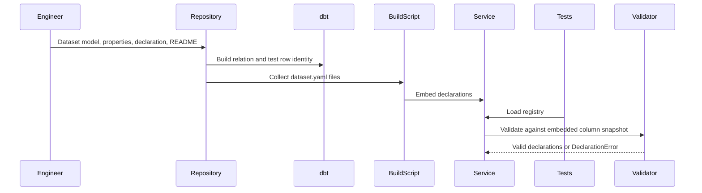
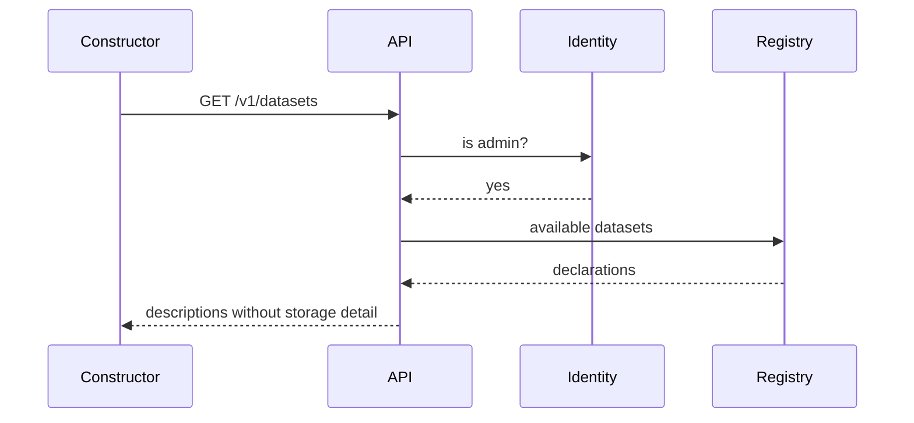

# Technical Design — Datasets

- [ ] `p1` - **ID**: `cpt-insightspec-ds-design-datasets`

<!-- toc -->

- [1. Architecture Overview](#1-architecture-overview)
  - [1.1 Architectural Vision](#11-architectural-vision)
  - [1.2 Architecture Drivers](#12-architecture-drivers)
  - [1.3 Architecture Layers](#13-architecture-layers)
- [2. Principles & Constraints](#2-principles--constraints)
  - [2.1 Design Principles](#21-design-principles)
  - [2.2 Constraints](#22-constraints)
- [3. Technical Architecture](#3-technical-architecture)
  - [3.1 Domain Model](#31-domain-model)
  - [3.2 Component Model](#32-component-model)
  - [3.3 API Contracts](#33-api-contracts)
  - [3.4 Internal Dependencies](#34-internal-dependencies)
  - [3.5 External Dependencies](#35-external-dependencies)
  - [3.6 Interactions & Sequences](#36-interactions--sequences)
  - [3.7 Database schemas & tables](#37-database-schemas--tables)
  - [3.8 Deployment Topology](#38-deployment-topology)
- [4. Additional context](#4-additional-context)
  - [Dataset authoring and lifecycle](#dataset-authoring-and-lifecycle)
  - [Tenant-defined datasets (planned)](#tenant-defined-datasets-planned)
  - [Access policies (planned)](#access-policies-planned)
  - [Validation limits and open semantics](#validation-limits-and-open-semantics)
- [5. Traceability](#5-traceability)

<!-- /toc -->

## 1. Architecture Overview

### 1.1 Architectural Vision

A dataset declaration binds one prepared relation to its queryable fields and row identity.
The analytics service embeds shipped declarations, validates them against a column snapshot,
and exposes their query metadata through an in-memory registry and discovery API.

Dataset models apply deduplication, attribution, and exclusion rules before queries run.
The [query engine](https://github.com/constructorfabric/insight/blob/d912c610da33259475d817fc009d34de35b8fe10/docs/domain/query-engine/DESIGN.md) consumes declarations for query execution;
this module owns definitions and discovery.

**Implemented**: shipped declarations, offline schema validation, registry lookup, admin-only
discovery, and the commits and file changes relations.

**Planned**: tenant-defined datasets, approval and versioning, live-catalog validation, richer
field metadata, value suggestions, and access policies. Proposed extensions appear in
Section 4; they are not part of the current runtime.

### 1.2 Architecture Drivers

**ADRs**: none. Tenant-defined dataset storage and composition remain design proposals.

#### Functional Drivers

| Requirement | Design Response |
|-------------|------------------|
| `cpt-insightspec-ds-fr-single-home` | `src/ingestion/datasets/<key>/` holds model, dbt properties, declaration and README |
| `cpt-insightspec-ds-fr-grain` | `row_identity` in the declaration; a dbt uniqueness test over the same columns |
| `cpt-insightspec-ds-fr-fields` | dimensions with `label_field`, measurables, time fields with one default; every stable column declared |
| `cpt-insightspec-ds-fr-absent-values` | `absent_value` required on a nullable dimension, refused on a non-nullable one |
| `cpt-insightspec-ds-fr-correctness-baked` | dedup, attribution and supersede rules live in the model; the shared dedup is its own relation |
| `cpt-insightspec-ds-fr-registry` | embedded shipped declarations; tenant-store integration planned |
| `cpt-insightspec-ds-fr-validated` | validation against the embedded snapshot; live-catalog validation planned |
| `cpt-insightspec-ds-fr-discovery` | `GET /v1/datasets` and `GET /v1/datasets/{key}` describe declarations, never storage |
| `cpt-insightspec-ds-fr-field-metadata` | planned: field labels, descriptions, units, and value suggestions |
| `cpt-insightspec-ds-fr-first-two` | `git_commits` and `git_file_changes`, over the shared authored-change relation |
| `cpt-insightspec-ds-fr-own-datasets` | planned: derived, saved-query, and imported datasets |
| `cpt-insightspec-ds-fr-own-validated` | planned: shared validation rules and errors |
| `cpt-insightspec-ds-fr-approval` | planned: author-only drafts and administrator approval |
| `cpt-insightspec-ds-fr-versioning` | proposed: version records with author and approver |
| `cpt-insightspec-ds-fr-access-rules` | planned: declared policies, enforced by the query engine |

#### NFR Allocation

| NFR ID | NFR Summary | Allocated To | Design Response | Verification Approach |
|--------|-------------|--------------|-----------------|----------------------|
| `cpt-insightspec-ds-nfr-additive` | dataset extensibility | declaration format | the engine reads declarations; adding one is a folder plus a build-script pickup | a dataset added with no diff under the engine modules |
| `cpt-insightspec-ds-nfr-fail-early` | validation before use | validator | shipped declarations validated in unit tests against the embedded snapshot; runtime validation on save is planned | tests over deliberately broken declarations |
| `cpt-insightspec-ds-nfr-cheap-discovery` | discovery makes no warehouse queries | registry | declarations are resident; describe reads memory | discovery handler holds no ClickHouse call |

### 1.3 Architecture Layers

```text
dataset folder
  model + schema.yml -- dbt build --> prepared relation
  dataset.yaml ------ build.rs ---> embedded declarations
                                         |
column snapshot --------------------> validator
                                         |
                                      registry
                                         |
                                  discovery API
```

- [ ] `p3` - **ID**: `cpt-insightspec-ds-tech-layers`

| Layer | Responsibility | Technology |
|---|---|---|
| Consumer | Dataset selection and query construction | Constructor page, query engine |
| API | Administrator check and discovery responses | Rust, axum |
| Domain | Declaration types, validation, registry, descriptions | Rust, serde_yaml |
| Data preparation | Dataset relations and grain tests | dbt, ClickHouse |

## 2. Principles & Constraints

### 2.1 Design Principles

#### Declared query surface

- [ ] `p1` - **ID**: `cpt-insightspec-ds-principle-declaration`

Consumers may reference only declared fields. Storage metadata remains internal to the
query engine and registry.

#### Dataset colocation

- [ ] `p1` - **ID**: `cpt-insightspec-ds-principle-colocation`

Keep the model, dbt properties, declaration, and README together so changes can be reviewed
as one unit. Shared preparation models remain outside individual dataset folders.

#### Prepared-data correctness

- [ ] `p1` - **ID**: `cpt-insightspec-ds-principle-correct-relation`

Apply counting and attribution rules in data preparation. Verify the resulting row identity
with dbt uniqueness tests.

#### Shared registry contract

- [ ] `p1` - **ID**: `cpt-insightspec-ds-principle-one-registry`

The planned tenant-defined extension uses the same declaration contract and validator as
shipped datasets, with additional persistence and visibility controls.

### 2.2 Constraints

#### Embedded shipped declarations

- [ ] `p1` - **ID**: `cpt-insightspec-ds-constraint-embedded`

Shipped declarations are embedded at build time and change only with a product release.
They are not stored in a runtime database.

#### dbt declaration exclusion

- [ ] `p1` - **ID**: `cpt-insightspec-ds-constraint-dbt-ignores-declarations`

The datasets directory is a dbt model path. `.dbtignore` excludes `dataset.yaml` so dbt does
not parse declarations as model properties.

#### Catalog validation

- [ ] `p1` - **ID**: `cpt-insightspec-ds-constraint-catalog-checked`

Declarations must satisfy the validator's field, type, read-discipline, time-field, and
row-identity checks against the supplied catalog.

#### Prepared relations

- [ ] `p1` - **ID**: `cpt-insightspec-ds-constraint-prepared-only`

A dataset binds one prepared serving relation. Raw and intermediate relations, writes, and
query-time joins beyond declared lookups are outside this contract.

## 3. Technical Architecture

### 3.1 Domain Model

**Technology**: YAML declarations, Rust domain types, JSON column snapshot.

**Location**: `src/ingestion/datasets/` and
`src/backend/services/analytics/src/domain/datasets/`.

| Entity | Responsibility | Source |
|---|---|---|
| Dataset | Relation binding, queryable fields, and row identity | `datasets/declaration.rs` |
| Dimension | Grouping/filtering field, optional label field, null representation | `datasets/declaration.rs` |
| Measurable | Numeric field available for aggregation | `datasets/declaration.rs` |
| TimeField | Query time field with a default marker | `datasets/declaration.rs` |
| FieldCatalog | Relations, engine families, and typed columns | `field_catalog/columns.snapshot.json` |
| DeclarationError | Validation failure with dataset and field context | `datasets/validate.rs` |
| DatasetDescription | Public query metadata | `datasets/describe.rs` |

#### Declaration fields

| Field | Meaning |
|---|---|
| `key` | Unique dataset identifier |
| `database`, `relation` | Prepared relation backing the dataset |
| `read_discipline` | `plain` or `final`, compatible with the relation's engine family |
| `tenant_field` | Column used for tenant scoping by the query engine |
| `time_fields` | Event-time fields, exactly one marked as default |
| `dimensions` | Grouping/filtering fields, optional `label_field` and `absent_value` |
| `measurables` | Numeric fields available for aggregation |
| `row_identity` | Non-empty list of fields defining row uniqueness |

For a complete example, see
[the file changes declaration](../../../src/ingestion/datasets/git_file_changes/dataset.yaml).
It binds `git_file_changes`, defaults to `authored_at`, associates `author_email` with
`author_name`, and declares `__unknown__` for null `source_id` values.

`row_identity` declares grain; it does not enforce database uniqueness. The dataset's dbt
test verifies uniqueness against materialized rows.

A `DatasetDescription` exposes query metadata and omits the database, relation, read
discipline, tenant field, and row identity. A dimension's public `label` names its result
column, such as `author_email_label`, rather than the backing label field `author_name`.

### 3.2 Component Model

```text
embedded declarations + column snapshot
                   |
                validator
                   |
                registry --> describe --> discovery API
```

#### Dataset declarations

- [ ] `p1` - **ID**: `cpt-insightspec-ds-component-declarations`

##### Why this component exists

Defines a relation's query contract independently of query execution.

##### Responsibility scope

Owns declaration types and build-time collection through `DATASETS_DIR`. The analytics image
receives the datasets directory as a named additional build context. Each directory
under `src/ingestion/datasets/<key>/` contains:

| File | Purpose |
|---|---|
| `<key>.sql` | dbt model |
| `schema.yml` | Column documentation and row-identity test |
| `dataset.yaml` | Query declaration |
| `README.md` | Grain, provenance, and semantic caveats |

##### Responsibility boundaries

dbt builds the relation. The declaration does not execute queries or handle HTTP requests.

##### Related components (by ID)

- `cpt-insightspec-ds-component-validator` — validates declarations
- `cpt-insightspec-ds-component-registry` — loads declarations

#### Validator

- [ ] `p1` - **ID**: `cpt-insightspec-ds-component-validator`

##### Why this component exists

Rejects declarations incompatible with their schema catalog.

##### Responsibility scope

- Require a lowercase snake_case key and an existing relation.
- Check every referenced column and its role-compatible type: text, UUID, boolean, or
  numeric dimensions; numeric measurables; date or datetime time fields.
- Require `absent_value` for nullable dimensions and reject it for non-nullable dimensions.
- Require a text or UUID tenant field; label fields must exist and have printable types.
- Reject duplicate fields within the time-field, dimension, and measurable lists.
- Match `read_discipline` to the engine family; merge-dependent engines require `final`.
- Require exactly one default time field and a non-empty row identity.
- Reject sentinels containing parameter placeholders.

The registry additionally rejects duplicate dataset keys. Null representation does not
define normalization of empty strings or source-specific missing-value sentinels.

##### Responsibility boundaries

Receives a catalog; performs no warehouse reads. It checks schema compatibility, not row
uniqueness or the correctness of deduplication and attribution.

##### Related components (by ID)

- `cpt-insightspec-ds-component-field-catalog` — supplies schema metadata
- `cpt-insightspec-ds-component-registry` — invokes validation

#### Field catalog

- [ ] `p1` - **ID**: `cpt-insightspec-ds-component-field-catalog`

##### Why this component exists

Provides schema metadata for offline validation.

##### Responsibility scope

Loads the committed column snapshot regenerated by the bootstrap DDL dump. The snapshot
contains relation names, engine families, and column types.

##### Responsibility boundaries

The snapshot describes the generated schema, not a running warehouse. Live-catalog loading
and invalidation for tenant-defined datasets remain planned.

##### Related components (by ID)

- `cpt-insightspec-ds-component-validator` — consumes the catalog

#### Registry

- [ ] `p1` - **ID**: `cpt-insightspec-ds-component-registry`

##### Why this component exists

Provides shared declaration lookup and enumeration.

##### Responsibility scope

Parses and validates embedded declarations on first use, caching the result in memory.
Exposes key lookup and enumeration in declaration order. Unit tests invoke the same loading
path, so invalid shipped declarations fail that test run.

##### Responsibility boundaries

No query execution or tenant-defined loading. Test-time validation checks the snapshot,
not a running warehouse. API error behavior is specified in Section 3.3.

##### Related components (by ID)

- `cpt-insightspec-ds-component-validator` — validates loaded declarations
- `cpt-insightspec-ds-component-discovery-api` — consumes the registry

#### Discovery API

- [ ] `p1` - **ID**: `cpt-insightspec-ds-component-discovery-api`

##### Why this component exists

Makes query metadata available to clients without repository or warehouse access.

##### Responsibility scope

Checks administrator permission and returns dataset descriptions. Unknown keys produce a
not-found response identifying the requested key.

##### Responsibility boundaries

Returns no storage metadata and performs no warehouse queries. Broader visibility depends
on the planned access-policy design.

##### Related components (by ID)

- `cpt-insightspec-ds-component-registry` — supplies declarations
- `cpt-insightspec-ds-component-tenant-registry` — planned source of tenant-defined declarations

#### Tenant registry (planned)

- [ ] `p2` - **ID**: `cpt-insightspec-ds-component-tenant-registry`

##### Why this component exists

Tenant-defined datasets need persistence, versioning, and approval controls.

##### Responsibility scope

Proposed storage for dataset versions and approval state, exposing author-only drafts and
approved tenant datasets through the shared registry. Section 4 records unresolved design.

##### Responsibility boundaries

Does not store or modify shipped declarations. Not implemented.

##### Related components (by ID)

- `cpt-insightspec-ds-component-registry` — planned integration
- `cpt-insightspec-ds-component-validator` — shared validation contract

### 3.3 API Contracts

- [ ] `p1` - **ID**: `cpt-insightspec-ds-interface-discovery-api`

- **Contracts**: `cpt-insightspec-ds-contract-prepared-data`
- **PRD interface**: `cpt-insightspec-ds-interface-discovery`
- **Technology**: REST/OpenAPI, JSON, RFC 9457 problem envelopes
- **Location**: [openapi.json](../../components/backend/analytics/openapi.json)

**Endpoints Overview**:

| Method | Path | Description | Stability |
|--------|------|-------------|-----------|
| `GET` | `/v1/datasets` | List dataset descriptions | unstable (admin-only) |
| `GET` | `/v1/datasets/{key}` | Describe a dataset | unstable (admin-only) |

Descriptions contain the dataset key, time fields and default, dimensions with optional
null representation and result-label column, and measurables. Query limits belong to the
query engine.

Discovery reads the registry after the administrator check. Listing returns a server error
if registry validation fails. Detail lookup returns not-found for an unknown key; its current
lookup also maps registry validation failure to not-found.

### 3.4 Internal Dependencies

| Dependency Module | Interface Used | Purpose |
|-------------------|----------------|----------|
| identity client | admin check over the forwarded session | restricts discovery to administrators |
| toolkit canonical errors | resource-scoped builders | not-found and permission envelopes |
| dbt project | model paths and `.dbtignore` | builds the relations, ignores declarations |

### 3.5 External Dependencies

#### ClickHouse

| Dependency Module | Interface Used | Purpose |
|-------------------|---------------|---------|
| dbt | model materialization | builds each dataset's relation |
| field catalog | column snapshot dumped from a bootstrap warehouse | validates declarations offline |

### 3.6 Interactions & Sequences

#### Validate shipped datasets

**ID**: `cpt-insightspec-ds-seq-ship`

**Use cases**: `cpt-insightspec-ds-usecase-ship-one`

**Actors**: `cpt-insightspec-ds-actor-engineer`



**Description**: dbt verifies row uniqueness; registry tests verify declaration compatibility
with the snapshot. Neither is a live-schema check.

#### Discover datasets

**ID**: `cpt-insightspec-ds-seq-describe`

**Use cases**: `cpt-insightspec-ds-usecase-discover`

**Actors**: `cpt-insightspec-ds-actor-constructor`, `cpt-insightspec-ds-actor-author`



**Description**: authorized requests return metadata from memory without warehouse queries.

### 3.7 Database schemas & tables

- [ ] `p2` - **ID**: `cpt-insightspec-ds-db-relations`

One relation per dataset plus shared `git_authored_file_changes` preparation. Full column
definitions live in each model's `schema.yml`; the tables below summarize their roles.

#### Table: commits

Relation: `git_commits`.

- [ ] `p2` - **ID**: `cpt-insightspec-ds-dbtable-git-commits`

**Schema**:

| Column | Type | Description |
|--------|------|-------------|
| tenant_id | Nullable(String) | tenant |
| commit_hash | String | the commit |
| author_email, author_name | String | author and label |
| authored_at, authored_date | DateTime, Date | event time and its day |
| branch_scope, repository, project, source (+ `_label`) | String | dimensions inherited from the commit |
| message | String | commit message |
| lines_added, lines_removed | Nullable(Int64) | attributed line counts after content deduplication |

**Sort key**: (tenant_id, author_email, authored_at)

**Constraints**: one row per (tenant_id, source, commit_hash), dbt-tested

**Additional info**: partitioned by month of authored_date

#### Table: file changes

Relation: `git_file_changes`.

- [ ] `p2` - **ID**: `cpt-insightspec-ds-dbtable-git-file-changes`

**Schema**:

| Column | Type | Description |
|--------|------|-------------|
| tenant_id, commit_hash, file_path | Nullable(String), String, String | identity with change_type |
| author_email, author_name, authored_at, authored_date | String, String, DateTime, Date | inherited from the commit |
| category, file_extension, change_type (+ `_label`) | String | file dimensions |
| branch_scope, repository, project, source (+ `_label`) | String | dimensions inherited from the commit |
| lines_added, lines_removed | Nullable(Int64) | sum over retained content identities |

**Sort key**: (tenant_id, author_email, authored_at)

**Constraints**: one row per (tenant_id, source, commit_hash, file_path, change_type), dbt-tested

**Additional info**: built from the authored-change relation below

#### Table: authored file changes

Relation: `git_authored_file_changes`.

- [ ] `p2` - **ID**: `cpt-insightspec-ds-dbtable-git-authored-file-changes`

**Schema**:

| Column | Type | Description |
|--------|------|-------------|
| tenant_id, data_source, commit_hash, file_path | Nullable(String), String, String, String | attach key and path |
| source_id, project_key, repo_slug | Nullable(String), String, String | retained commit's source, project, and repository |
| file_extension, change_type | String | as collected |
| lines_added, lines_removed | Nullable(Int64) | as collected |

**Sort key**: (tenant_id, data_source, commit_hash)

**Constraints**: one row per change content, earliest commit wins; superseded changes excluded

**Additional info**: shared deduplicated input for the git datasets and metric evidence;
not registered as a dataset.

### 3.8 Deployment Topology

No deployable of its own. Relations are built by the deploy hook's dbt run; shipped
declarations travel inside the analytics image.

## 4. Additional context

### Dataset authoring and lifecycle

A shipped dataset addition includes its model, column documentation, row-identity test,
declaration, README, and regenerated column snapshot. The registry discovers embedded
declarations automatically; no query-engine changes are required.

Shipped definitions evolve with product releases. Removing a declaration removes it from
discovery; deletion and compatibility with saved queries must be considered together.

### Tenant-defined datasets (planned)

| Kind | Definition |
|---|---|
| Derived | Filtered or relabelled parent dataset with custom categories |
| Saved query | Query result exposed as a reusable dataset |
| Imported | Uploaded data or a referenced tenant relation |

The proposed design stores tenant-defined metadata in the analytics service's relational
store: dataset key, tenant, version, declaration, state, author, approver, and timestamps.
Edits create new versions. Drafts are author-only; approved versions are available within
the tenant according to access policies. Validation occurs on save and read, with
revalidation after schema changes.

This storage design is not implemented. Open decisions:

- Composition with parent datasets and permitted nesting depth.
- Whether saved queries retain their requests or freeze their results.
- Tenant quotas and administrator review workflow.
- Live-catalog loading, schema-change detection, and cache invalidation.

### Access policies (planned)

Declarations would carry dataset access, row visibility, column visibility or masking, and
personal-data classification. The query engine would enforce these policies during planning.
Policy representation and enforcement integration remain undesigned; current discovery is
administrator-only.

### Validation limits and open semantics

- Catalog validation checks field references and types, not deployed-schema compatibility.
- Row-identity tests check uniqueness, not attribution or deduplication correctness.
- Null dimensions require `absent_value`. Empty-string and source-sentinel normalization
  are not established by this contract.
- The PRD requires stable dimensions to be exposed, but field-selection criteria remain open.

## 5. Traceability

- **PRD**: [PRD.md](PRD.md)
- **Consumer**: [query engine design](https://github.com/constructorfabric/insight/blob/d912c610da33259475d817fc009d34de35b8fe10/docs/domain/query-engine/DESIGN.md)
- **Contract**: [openapi.json](../../components/backend/analytics/openapi.json)

**Revision 1.1**: consolidated declaration and validation contracts, clarified runtime and
snapshot boundaries, and separated implemented behavior from proposed extensions.
