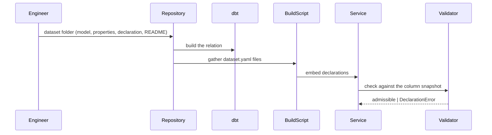
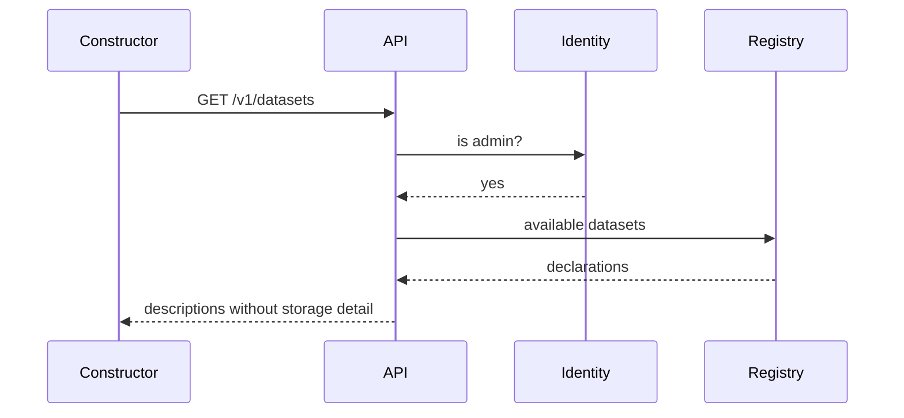

# Technical Design — Data Sets

- [ ] `p1` - **ID**: `cpt-insightspec-ds-design-datasets`

<!-- toc -->

- [1. Architecture Overview](#1-architecture-overview)
  - [1.1 Architectural Vision](#11-architectural-vision)
  - [1.2 Architecture Drivers](#12-architecture-drivers)
  - [1.3 Architecture Layers](#13-architecture-layers)
- [2. Principles & Constraints](#2-principles--constraints)
  - [2.1 Design Principles](#21-design-principles)
  - [2.2 Constraints](#22-constraints)
- [3. Technical Architecture](#3-technical-architecture)
  - [3.1 Domain Model](#31-domain-model)
  - [3.2 Component Model](#32-component-model)
  - [3.3 API Contracts](#33-api-contracts)
  - [3.4 Internal Dependencies](#34-internal-dependencies)
  - [3.5 External Dependencies](#35-external-dependencies)
  - [3.6 Interactions & Sequences](#36-interactions--sequences)
  - [3.7 Database schemas & tables](#37-database-schemas--tables)
  - [3.8 Deployment Topology](#38-deployment-topology)
- [4. Additional context](#4-additional-context)
  - [The declaration](#the-declaration)
  - [Rules a declaration must satisfy](#rules-a-declaration-must-satisfy)
  - [Anatomy of a dataset folder](#anatomy-of-a-dataset-folder)
  - [Adding a dataset](#adding-a-dataset)
  - [Lifecycle](#lifecycle)
  - [Kinds of dataset](#kinds-of-dataset)
  - [Tenant-defined datasets](#tenant-defined-datasets)
  - [Access rules](#access-rules)
  - [Not a dataset](#not-a-dataset)
- [5. Traceability](#5-traceability)

<!-- /toc -->

## 1. Architecture Overview

### 1.1 Architectural Vision

A dataset is a declaration bound to one prepared relation. The declaration says what the
relation is for: its grain, the columns that may be grouped or filtered, the columns that may
be folded, the columns that carry event time, the labels that travel with values, and how the
relation must be read to be duplicate-free. Everything downstream — discovery, planning,
compilation, access rules — reads that declaration and nothing else about storage.

The declaration lives beside the model that materializes it, one folder per dataset, so a
dataset is reviewed, shipped and reasoned about as one unit. The service embeds the shipped
declarations at build time and merges them with tenant-defined ones into a single in-memory
registry. One loader, one validator, one list.

Correctness is a property of the relation, not of the question: dedup, attribution and
exclusion are applied once by the model. The declaration then states the grain that results,
and a data test enforces it. Realises [PRD.md](PRD.md); the consumer is the
[query engine](../query-engine/DESIGN.md).

### 1.2 Architecture Drivers

**ADRs**: none yet; the first is expected with tenant-defined datasets.

#### Functional Drivers

| Requirement | Design Response |
|-------------|------------------|
| `cpt-insightspec-ds-fr-single-home` | `src/ingestion/datasets/<key>/` holds model, dbt properties, declaration and README |
| `cpt-insightspec-ds-fr-grain` | `row_identity` in the declaration; a dbt uniqueness test over the same columns |
| `cpt-insightspec-ds-fr-fields` | dimensions with `label_field`, measurables, time fields with one default; every stable column declared |
| `cpt-insightspec-ds-fr-absent-values` | `absent_value` required on a nullable dimension, refused on a non-nullable one |
| `cpt-insightspec-ds-fr-correctness-baked` | dedup, attribution and supersede rules live in the model; the shared dedup is its own relation |
| `cpt-insightspec-ds-fr-registry` | one in-memory registry: shipped from the binary, tenant-defined from the service store |
| `cpt-insightspec-ds-fr-validated` | one validator against the field catalog: the embedded snapshot in CI, the live catalog at load |
| `cpt-insightspec-ds-fr-discovery` | `GET /v1/datasets` and `GET /v1/datasets/{key}` describe declarations, never storage |
| `cpt-insightspec-ds-fr-field-metadata` | declaration gains label, description and unit; a values endpoint reads distinct values |
| `cpt-insightspec-ds-fr-first-two` | `git_commits` and `git_file_changes`, over the shared authored-change relation |
| `cpt-insightspec-ds-fr-own-datasets` | three runtime forms over the same declaration shape |
| `cpt-insightspec-ds-fr-own-validated` | runtime declarations take the same validator and the same violations |
| `cpt-insightspec-ds-fr-approval` | state on the stored declaration; the registry exposes drafts to their author alone |
| `cpt-insightspec-ds-fr-versioning` | a new row per edit, keyed by dataset and version, with author and approver |
| `cpt-insightspec-ds-fr-access-rules` | policies declared beside the fields they bind; the engine enforces them at plan time |

#### NFR Allocation

| NFR ID | NFR Summary | Allocated To | Design Response | Verification Approach |
|--------|-------------|--------------|-----------------|----------------------|
| `cpt-insightspec-ds-nfr-additive` | a new dataset costs no engine change | declaration format | the engine reads declarations; adding one is a folder plus a build-script pickup | a dataset added with no diff under the engine modules |
| `cpt-insightspec-ds-nfr-fail-early` | broken definitions never reach people | validator | shipped declarations validated in unit tests against the embedded snapshot; runtime ones validated on save | tests over deliberately broken declarations |
| `cpt-insightspec-ds-nfr-cheap-discovery` | discovery costs no warehouse read | registry | declarations are resident; describe reads memory | discovery handler holds no ClickHouse call |

### 1.3 Architecture Layers

```text
src/ingestion/datasets/<key>/          dbt model · properties · declaration · README
        │ dbt build                            │ build script (named build context)
        ▼                                      ▼
ClickHouse relation  ◀── validated against ── analytics service
                                               ├─ domain::datasets   registry · validator · describe
                                               └─ api::datasets      GET /v1/datasets[/{key}]
                                                       │
                                                 query engine, constructor
```

- [ ] `p3` - **ID**: `cpt-insightspec-ds-tech-layers`

| Layer | Responsibility | Technology |
|-------|---------------|------------|
| Presentation | lists what can be asked about | React constructor page |
| Application | admin gate, describe, respond | Rust, axum |
| Domain | declaration model, validation, registry, describe | Rust, serde_yaml |
| Data definition | model, dbt properties, declaration, README per dataset | dbt, YAML |
| Infrastructure | prepared relations | ClickHouse MergeTree |

## 2. Principles & Constraints

### 2.1 Design Principles

#### A dataset is a declaration, not a table

- [ ] `p1` - **ID**: `cpt-insightspec-ds-principle-declaration`

The relation is an implementation detail of the dataset. Consumers see the declaration:
grain, fields, labels, time, policies. Nothing downstream may reach past it to a column the
declaration does not name.

#### Everything about one dataset in one folder

- [ ] `p1` - **ID**: `cpt-insightspec-ds-principle-colocation`

Model, properties, declaration and README live together, outside the medallion layout, so a
dataset is added, reviewed and deleted as one unit and its parts cannot drift.

#### Correctness belongs to the relation

- [ ] `p1` - **ID**: `cpt-insightspec-ds-principle-correct-relation`

Dedup, attribution and exclusion are applied once where the data is built. A dataset's grain
is then a fact a test can enforce, not a rule each question must remember.

#### One registry, whoever wrote the declaration

- [ ] `p1` - **ID**: `cpt-insightspec-ds-principle-one-registry`

Shipped and tenant-defined declarations share one shape, one validator and one list. The only
differences are where the declaration is stored and who may see it.

### 2.2 Constraints

#### Shipped declarations ship with the binary

- [ ] `p1` - **ID**: `cpt-insightspec-ds-constraint-embedded`

The datasets folder is outside the service's build context, so it arrives as a named
additional build context and the build script embeds every `dataset.yaml`. A shipped
declaration is never written to any database and never edited in a running installation.

#### dbt must not read declarations

- [ ] `p1` - **ID**: `cpt-insightspec-ds-constraint-dbt-ignores-declarations`

The datasets folder is a dbt model path, so dbt would otherwise try to parse `dataset.yaml`
as its own properties. `.dbtignore` excludes it by name.

#### Every named column must exist

- [ ] `p1` - **ID**: `cpt-insightspec-ds-constraint-catalog-checked`

A declaration is only admissible if the catalog carries every column it names with a
compatible type, its read discipline matches the relation's engine family, and it declares
exactly one default time field and a non-empty row identity.

#### Prepared relations only

- [ ] `p1` - **ID**: `cpt-insightspec-ds-constraint-prepared-only`

A dataset binds one relation in the serving database. No raw or intermediate layer, no
query-time joins beyond a declared lookup, no writes.

## 3. Technical Architecture

### 3.1 Domain Model

**Technology**: YAML declarations, Rust types, a JSON snapshot of the warehouse columns.

**Location**: `src/ingestion/datasets/`, `src/backend/services/analytics/src/domain/datasets/`

**Core Entities**:

| Entity | Description | Schema |
|--------|-------------|--------|
| Dataset | key, database, relation, read discipline, tenant field, time fields, dimensions, measurables, row identity | `datasets/declaration.rs` |
| Dimension | field, optional label field, absent value when nullable | `datasets/declaration.rs` |
| Measurable | a numeric column an aggregate may fold | `datasets/declaration.rs` |
| TimeField | an event-time column; exactly one is the default | `datasets/declaration.rs` |
| FieldCatalog | the relations, engines and columns declarations are checked against | `field_catalog/columns.snapshot.json` |
| DeclarationError | why a declaration is inadmissible, naming the dataset and field | `datasets/validate.rs` |
| DatasetDescription | the queryable surface, without storage | `datasets/describe.rs` |

**Relationships**:
- Dataset → FieldCatalog: every named column is checked; a mismatch is a `DeclarationError`.
- Dataset → relation: one dataset binds exactly one prepared relation.
- Dataset → DatasetDescription: describe drops database, relation, read discipline, tenant
  field and row identity.

### 3.2 Component Model

```text
datasets folder ──build script──▶ registry ──▶ describe ──▶ discovery API
                                     ▲
                    tenant store ────┘ (later)
                                     │
                                validator ──▶ field catalog
```

#### Dataset declarations

- [ ] `p1` - **ID**: `cpt-insightspec-ds-component-declarations`

##### Why this component exists

Something must state what a relation is for, in a form both a person and the engine can read.

##### Responsibility scope

The declaration format and its parsed types; one folder per dataset holding model, dbt
properties, `dataset.yaml` and README; the build script that gathers shipped declarations
through the `DATASETS_DIR` path.

##### Responsibility boundaries

Knows nothing about questions, HTTP or tenants. Does not build the relation; dbt does.

##### Related components (by ID)

- `cpt-insightspec-ds-component-validator` — checked by
- `cpt-insightspec-ds-component-registry` — held by

#### Validator

- [ ] `p1` - **ID**: `cpt-insightspec-ds-component-validator`

##### Why this component exists

A declaration that outgrew its relation must fail loudly and early, in the same words
wherever it came from.

##### Responsibility scope

Checks key shape, relation presence, column presence and type class per role, nullability
against `absent_value`, label fields, read discipline against the engine family, exactly one
default time field, a non-empty row identity, no duplicate keys, and that a declared sentinel
carries no parameter placeholder.

##### Responsibility boundaries

One implementation for shipped and tenant-defined declarations. Does not read the warehouse
itself; it is given a catalog.

##### Related components (by ID)

- `cpt-insightspec-ds-component-field-catalog` — reads
- `cpt-insightspec-ds-component-registry` — used by

#### Field catalog

- [ ] `p1` - **ID**: `cpt-insightspec-ds-component-field-catalog`

##### Why this component exists

Validation needs to know what the warehouse actually holds.

##### Responsibility scope

The relations, engine families and typed columns available; loaded from the snapshot
committed in the repository, which the DDL dump regenerates.

##### Responsibility boundaries

A snapshot, not a live connection; the live-catalog read that tenant-defined datasets need
arrives with them.

##### Related components (by ID)

- `cpt-insightspec-ds-component-validator` — read by

#### Registry

- [ ] `p1` - **ID**: `cpt-insightspec-ds-component-registry`

##### Why this component exists

Every consumer must see one list, whoever wrote each entry.

##### Responsibility scope

Parses and validates the embedded declarations once, exposes lookup by key and the list in
declaration order, and will merge tenant-defined declarations from the service store under
the same types.

##### Responsibility boundaries

Serves declarations; never answers a question about the data. Unusable declarations make
every read a server error, never a refusal of the caller's request.

##### Related components (by ID)

- `cpt-insightspec-ds-component-validator` — depends on
- `cpt-insightspec-ds-component-discovery-api` — read by

#### Discovery API

- [ ] `p1` - **ID**: `cpt-insightspec-ds-component-discovery-api`

##### Why this component exists

Pages and people need the list without reading the repository.

##### Responsibility scope

`GET /v1/datasets` and `GET /v1/datasets/{key}`, admin-gated; describe maps a declaration to
its queryable surface; an unknown key is a not-found naming it.

##### Responsibility boundaries

No storage detail leaves: database, relation, read discipline, tenant field and row identity
are dropped. Reads no warehouse.

##### Related components (by ID)

- `cpt-insightspec-ds-component-registry` — reads
- `cpt-insightspec-ds-component-tenant-registry` — will read

#### Tenant registry

- [ ] `p2` - **ID**: `cpt-insightspec-ds-component-tenant-registry`

##### Why this component exists

Datasets people add are mutable, versioned and approved — none of which a shipped
declaration is.

##### Responsibility scope

Stores tenant-defined declarations in the service's own relational store with tenant, version,
author, approver and state; serves drafts to their author and approved ones to the tenant;
re-validates on read. *Needs design* below.

##### Responsibility boundaries

Never holds shipped declarations; never edits one.

##### Related components (by ID)

- `cpt-insightspec-ds-component-registry` — merges into
- `cpt-insightspec-ds-component-validator` — uses

### 3.3 API Contracts

- [ ] `p1` - **ID**: `cpt-insightspec-ds-interface-discovery-api`

- **Contracts**: `cpt-insightspec-ds-contract-prepared-data`
- **PRD interface**: `cpt-insightspec-ds-interface-discovery`
- **Technology**: REST/OpenAPI, JSON, RFC 9457 problem envelopes
- **Location**: [openapi.json](../../components/backend/analytics/openapi.json)

**Endpoints Overview**:

| Method | Path | Description | Stability |
|--------|------|-------------|-----------|
| `GET` | `/v1/datasets` | describe every available dataset | unstable (admin-only) |
| `GET` | `/v1/datasets/{key}` | describe one dataset | unstable (admin-only) |

A description carries the key, the time fields with their default, the dimensions with their
absent value and label column, and the measurables. The request bounds a question must stay
inside belong to the query engine and are added by it.

### 3.4 Internal Dependencies

| Dependency Module | Interface Used | Purpose |
|-------------------|----------------|----------|
| identity client | admin check over the forwarded session | gates discovery until access rules land |
| toolkit canonical errors | resource-scoped builders | not-found and permission envelopes |
| dbt project | model paths and `.dbtignore` | builds the relations, ignores declarations |

**Dependency Rules** (per project conventions):
- No circular dependencies
- Always use SDK modules for inter-module communication
- No cross-category sideways deps except through contracts
- Only integration/adapter modules talk to external systems
- `SecurityContext` must be propagated across all in-process calls

### 3.5 External Dependencies

#### ClickHouse

| Dependency Module | Interface Used | Purpose |
|-------------------|---------------|---------|
| dbt | model materialization | builds each dataset's relation |
| field catalog | column snapshot dumped from a bootstrap warehouse | validates declarations offline |

**Dependency Rules** (per project conventions):
- No circular dependencies
- Always use SDK modules for inter-module communication
- No cross-category sideways deps except through contracts
- Only integration/adapter modules talk to external systems
- `SecurityContext` must be propagated across all in-process calls

### 3.6 Interactions & Sequences

#### Ship a dataset

**ID**: `cpt-insightspec-ds-seq-ship`

**Use cases**: `cpt-insightspec-ds-usecase-ship-one`

**Actors**: `cpt-insightspec-ds-actor-engineer`



**Description**: a mismatch fails the test run; nothing reaches a caller.

#### Describe what is available

**ID**: `cpt-insightspec-ds-seq-describe`

**Use cases**: `cpt-insightspec-ds-usecase-discover`

**Actors**: `cpt-insightspec-ds-actor-constructor`, `cpt-insightspec-ds-actor-author`



**Description**: served from memory; no warehouse read.

### 3.7 Database schemas & tables

- [ ] `p2` - **ID**: `cpt-insightspec-ds-db-relations`

One relation per dataset, plus the shared authored-change relation both git datasets stand
on. Column documentation lives with each dataset's dbt properties.

#### Table: git_commits

- [ ] `p2` - **ID**: `cpt-insightspec-ds-dbtable-git-commits`

**Schema**:

| Column | Type | Description |
|--------|------|-------------|
| tenant_id | Nullable(String) | tenant |
| commit_hash | String | the commit |
| author_email, author_name | String | author and label |
| authored_at, authored_date | DateTime, Date | event time and its day |
| branch_scope, repository, project, source (+ `_label`) | String | inherited dimensions |
| message | String | commit message |
| lines_added, lines_removed | Nullable(Int64) | own contribution after the content dedup |

**PK**: (tenant_id, author_email, authored_at)

**Constraints**: one row per (tenant, source, commit_hash), dbt-tested

**Additional info**: partitioned by month of authored_date

#### Table: git_file_changes

- [ ] `p2` - **ID**: `cpt-insightspec-ds-dbtable-git-file-changes`

**Schema**:

| Column | Type | Description |
|--------|------|-------------|
| tenant_id, commit_hash, file_path | Nullable(String), String, String | identity with change_type |
| author_email, author_name, authored_at, authored_date | String, String, DateTime, Date | inherited from the commit |
| category, file_extension, change_type (+ `_label`) | String | file dimensions |
| branch_scope, repository, project, source (+ `_label`) | String | inherited dimensions |
| lines_added, lines_removed | Nullable(Int64) | summed over folded content identities |

**PK**: (tenant_id, author_email, authored_at)

**Constraints**: one row per (tenant, source, commit_hash, file_path, change_type), dbt-tested

**Additional info**: built from the authored-change relation below

#### Table: git_authored_file_changes

- [ ] `p2` - **ID**: `cpt-insightspec-ds-dbtable-git-authored-file-changes`

**Schema**:

| Column | Type | Description |
|--------|------|-------------|
| tenant_id, data_source, commit_hash, file_path | Nullable(String), String, String, String | attach key and path |
| source_id, project_key, repo_slug | Nullable(String), String, String | surviving commit's coordinates |
| file_extension, change_type | String | as collected |
| lines_added, lines_removed | Nullable(Int64) | as collected |

**PK**: (tenant_id, data_source, commit_hash)

**Constraints**: one row per change content, earliest commit wins; superseded changes excluded

**Additional info**: not a dataset — the shared dedup the file-change dataset and the metric
evidence both read, so its sort runs once per build

### 3.8 Deployment Topology

No deployable of its own. Relations are built by the deploy hook's dbt run; shipped
declarations travel inside the analytics image.

## 4. Additional context

### The declaration

```yaml
key: git_file_changes          # how a question names it
database: insight              # where the relation lives — never described to callers
relation: git_file_changes
read_discipline: plain         # plain | final, matched against the engine family

tenant_field: tenant_id        # the column every scan is scoped by

time_fields:                   # exactly one default
  - field: authored_at
    default: true

dimensions:                    # what may be grouped and filtered
  - field: author_email
    label_field: author_name   # the readable name travelling beside the value
  - field: source_id
    absent_value: __unknown__  # required when the column is nullable

measurables:                   # what may be folded
  - field: lines_added

row_identity:                  # what makes one row one fact
  - tenant_id
  - source
  - commit_hash
  - file_path
  - change_type
```

### Rules a declaration must satisfy

- Every named column exists in the catalog with a type its role admits: text, uuid, boolean
  or number for a dimension; number for a measurable; date or datetime for a time field.
- A nullable dimension declares `absent_value`; a non-nullable one must not.
- A label field exists and is printable.
- `read_discipline` matches the relation's engine family: a folding engine (Replacing,
  Collapsing, Summing, Aggregating, replicated or versioned) must be read collapsed.
- Exactly one time field is the default; the row identity is non-empty; the key is lowercase
  snake_case; no two datasets share a key.
- No declared sentinel contains a parameter placeholder.

### Anatomy of a dataset folder

```text
src/ingestion/datasets/git_file_changes/
  git_file_changes.sql   the model that materializes the relation
  schema.yml             dbt column docs and the grain test
  dataset.yaml           the declaration
  README.md              what one row is, where it comes from, what to watch for
```

The folder is a dbt model path, so `dbt build` finds the model and its properties;
`.dbtignore` keeps `dataset.yaml` out of dbt's hands. The analytics build script reads the
same folder through a named build context and embeds every declaration.

### Adding a dataset

1. Create the folder and the model; apply the counting rules in the model, not downstream.
2. Write `schema.yml`: a description per column, and a test that the row identity is unique.
3. Write `dataset.yaml`: grain, dimensions with labels, measurables, time fields.
4. Regenerate the column snapshot from a bootstrap warehouse so validation sees the new
   relation.
5. Write the README: what one row is, provenance, caveats.

No engine change is required at any step.

### Lifecycle

A shipped dataset is declared, validated at build, served and described, evolved by shipping
a new version of the product, and retired by deleting its folder. A tenant-defined one is
drafted, validated on save, usable by its author, approved by an administrator with its
access rules set, versioned on every edit, and retired by its owner.

### Kinds of dataset

| Kind | Where its declaration lives | Who may add one |
|---|---|---|
| Shipped | the product's repository, embedded in the image | product engineers |
| Derived | the tenant store, over a shipped or approved parent | anyone who may add datasets |
| Promoted saved question | the tenant store, over a saved question | anyone who may add datasets |
| Bring-your-own | the tenant store, over an uploaded or pointed-at relation | anyone who may add datasets |

### Tenant-defined datasets

*Needs design.* Stored in the analytics service's relational store — small, mutable,
versioned, approval-gated metadata, which the warehouse is the wrong shape for. One row per
dataset version: key, tenant, body, state, author, approver, timestamps. Editing writes a new
version; approval flips state; the registry merges approved rows for the tenant plus the
author's own drafts.

Open: how a derived dataset's plan composes with its parent's; whether a promoted saved
question is stored as its request or frozen; how deep composition may nest; per-tenant
quotas; the live-catalog read and its invalidation, since the embedded snapshot only covers
shipped datasets.

### Access rules

*Needs design.* Declared beside the fields they bind, enforced by the query engine at plan
time: dataset access (who may ask at all), row policy (a dimension bound to a caller
attribute), column policy (dropped or masked). The declaration also marks which columns
describe named people. See the engine's design for enforcement.

### Not a dataset

- **A metric.** A metric is one question with one answer; a dataset is what many questions
  are asked of.
- **A raw table.** Tables carry storage detail, no grain statement and no labels.
- **A chart.** Charts are what a question's answer is drawn as.

## 5. Traceability

- **PRD**: [PRD.md](PRD.md)
- **Consumer**: [query engine design](../query-engine/DESIGN.md)
- **Contract**: [openapi.json](../../components/backend/analytics/openapi.json)
