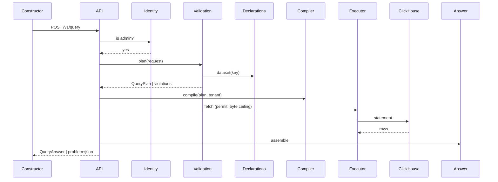

# Technical Design — Query Engine

- [ ] `p1` - **ID**: `cpt-insightspec-qe-design-query-engine`

<!-- toc -->

- [1. Architecture Overview](#1-architecture-overview)
  - [1.1 Architectural Vision](#11-architectural-vision)
  - [1.2 Architecture Drivers](#12-architecture-drivers)
  - [1.3 Architecture Layers](#13-architecture-layers)
- [2. Principles & Constraints](#2-principles--constraints)
  - [2.1 Design Principles](#21-design-principles)
  - [2.2 Constraints](#22-constraints)
- [3. Technical Architecture](#3-technical-architecture)
  - [3.1 Domain Model](#31-domain-model)
  - [3.2 Component Model](#32-component-model)
  - [3.3 API Contracts](#33-api-contracts)
  - [3.4 Internal Dependencies](#34-internal-dependencies)
  - [3.5 External Dependencies](#35-external-dependencies)
  - [3.6 Interactions & Sequences](#36-interactions--sequences)
  - [3.7 Database schemas & tables](#37-database-schemas--tables)
  - [3.8 Deployment Topology](#38-deployment-topology)
- [4. Additional context](#4-additional-context)
  - [Capability semantics](#capability-semantics)
  - [Saved queries](#saved-queries)
  - [Non-goals](#non-goals)
- [5. Traceability](#5-traceability)

<!-- /toc -->

## 1. Architecture Overview

### 1.1 Architectural Vision

One question contract over declared datasets. Each question compiles to one bounded,
parameterised ClickHouse scan per dataset and answers a typed table. The rules the schema
does not carry — session tenancy, duplicate-free reads, NULL folding, UTC day boundaries,
caps — are compiler steps applied to every question and pinned by rendered-SQL tests.

Three pure layers around one I/O shell. *Declarations*: what may be asked, validated at
build time against the warehouse column snapshot. *Validation*: bind a request or refuse it
with every violation named. *Compilation*: SQL text with engine-owned identifiers, caller
values bound. The shell runs the statement under a byte ceiling and a concurrency permit and
assembles the answer. Realises [PRD.md](PRD.md); migration in [MIGRATION.md](MIGRATION.md).

### 1.2 Architecture Drivers

**ADRs**: none yet; the first is expected with access policies.

#### Functional Drivers

| Requirement | Design Response |
|-------------|------------------|
| `cpt-insightspec-qe-fr-ask` | request → plan → compile → one scan; no metric definition in the path |
| `cpt-insightspec-qe-fr-group` | a labelled dimension answers `<field>_label` beside its value; every stable column declared |
| `cpt-insightspec-qe-fr-filter` | tagged filter variants; patterns bound as parameters, `match` compiled at validation; operator/target mismatch refused |
| `cpt-insightspec-qe-fr-fold` | `OrNull` folds; `count` alone reports 0 |
| `cpt-insightspec-qe-fr-bounds` | window cap; `LIMIT limit + 1` with `flags.truncated`; chunked byte ceiling; semaphore |
| `cpt-insightspec-qe-fr-refusal` | whole plan checked first; one `Violation {field, reason, detail}` per problem |
| `cpt-insightspec-qe-fr-boolean` | `any`/`all`/`not` variants → parenthesised predicates |
| `cpt-insightspec-qe-fr-relative-window` | resolved at plan time; answer reports `resolved_window` |
| `cpt-insightspec-qe-fr-derived` | `classify` → one `multiIf`; `time_part` → date-part function in the query zone |
| `cpt-insightspec-qe-fr-richer-folds` | more fold and window variants over the same plan (§4) |
| `cpt-insightspec-qe-fr-time-intelligence` | zone, week start, fiscal start as compiler inputs to every boundary |
| `cpt-insightspec-qe-fr-rows` | sibling row-level shape over the same predicates, keyed on `row_identity` |
| `cpt-insightspec-qe-fr-saved` | stored request re-planned on every read |
| `cpt-insightspec-qe-fr-cross-dataset` | one scan per dataset aligned on conformed dimensions; lookups joined on a unique key |
| `cpt-insightspec-qe-fr-funnels` | aggregate families over ClickHouse `windowFunnel`, `retention` |
| `cpt-insightspec-qe-fr-admin-gate` | `require_admin` before every query and discovery handler |
| `cpt-insightspec-qe-fr-access-policies` | policy predicates bound from the caller context at plan time, before any capability |

#### NFR Allocation

| NFR ID | NFR Summary | Allocated To | Design Response | Verification Approach |
|--------|-------------|--------------|-----------------|----------------------|
| `cpt-insightspec-qe-nfr-correctness` | correct by construction | compiler | tenancy predicate first; `FINAL` per read discipline; `OrNull` folds; `toDate(x, 'UTC')`; no `=` on nullable keys | rendered-SQL goldens; stand reconciliations |
| `cpt-insightspec-qe-nfr-bounded` | bounded cost | validation, executor, handler | 731-day window; 10 000 rows; 16 MiB chunked ceiling; 8-permit semaphore → 429 | unit tests per cap; stand 400/429 cases |
| `cpt-insightspec-qe-nfr-latency` | interactive latency | gold datasets, compiler | flat pre-joined relations; one scan; partitioned by month, sorted by tenant | stand timing; ClickHouse query log |
| `cpt-insightspec-qe-nfr-contract` | stable contract | contract DTOs | tagged unions with `deny_unknown_fields`; OpenAPI generated from types; CI drift gate | drift check; stand schema generation |
| `cpt-insightspec-qe-nfr-person-data` | person columns classified | declarations, executor | person columns named in the declaration; no engine store or cache; gate then policies govern reads | declaration tests; no persistence in the engine |

### 1.3 Architecture Layers

```text
constructor ──HTTP──▶ gateway ──▶ analytics service
                                   ├─ api     gate · extract · respond
                                   ├─ domain  declarations · validation · compile · answer
                                   └─ infra   bounded fetch · metrics ──▶ ClickHouse gold
ingestion (dbt) ─────────────────────────────────────────────────────▶ ClickHouse gold
```

- [ ] `p3` - **ID**: `cpt-insightspec-qe-tech-layers`

| Layer | Responsibility | Technology |
|-------|---------------|------------|
| Presentation | constructor: form → request; answer → table and chart | React, TanStack Query |
| Application | handlers: admin gate, extraction, error envelopes | Rust, axum, canonical errors |
| Domain | declarations, validation, compilation, answer assembly | Rust, pure functions |
| Infrastructure | bounded ClickHouse fetch, metrics, identity client | Rust, clickhouse client |
| Data | gold datasets from silver class relations | dbt, ClickHouse MergeTree |

## 2. Principles & Constraints

### 2.1 Design Principles

#### A contract, not SQL, from callers

- [ ] `p1` - **ID**: `cpt-insightspec-qe-principle-contract`

Callers send a small typed document. Only engine-owned identifiers reach SQL text; every
caller value binds. This is what makes tenancy, read discipline, NULL semantics, caps and
row policies enforceable without a SQL parser.

#### Declarations are the truth

- [ ] `p1` - **ID**: `cpt-insightspec-qe-principle-declarations`

What may be asked is declared per dataset and validated against the column snapshot at build
time. Every stable-valued column is a dimension. A request cannot name what no declaration
does.

#### Refuse by name

- [ ] `p1` - **ID**: `cpt-insightspec-qe-principle-refusals`

Check the whole request, then report every violation with field, machine reason and
admissible set. Server faults (unusable declarations, warehouse errors) are 500s, never
dressed as request errors.

#### Correct by construction

- [ ] `p1` - **ID**: `cpt-insightspec-qe-principle-correctness`

Rules the schema does not carry live in the compiler, pinned by exact rendered-SQL tests.

### 2.2 Constraints

#### Tenancy binds from the session

- [ ] `p1` - **ID**: `cpt-insightspec-qe-constraint-tenancy`

First predicate of every scan is the tenant from the security context. No request member
names a tenant; unknown members are refused.

#### Admin-only until access policies land

- [ ] `p1` - **ID**: `cpt-insightspec-qe-constraint-admin-gate`

Datasets carry person columns and declare no access policy yet: `POST /v1/query` and both
`GET /v1/datasets` routes refuse non-administrators. The change declaring the first policy
must specify what replaces the minimum-peer suppression of the metric surfaces.

#### Bounded on every axis

- [ ] `p1` - **ID**: `cpt-insightspec-qe-constraint-bounds`

Window ≤ 731 days inside the `Date` range; rows ≤ 10 000 plus one fetched to flag
truncation; answer ≤ 16 MiB enforced while receiving; 8 scans in flight per process; filter,
aggregate, axis, order counts and pattern lengths capped by contract constants.

#### Gold relations only

- [ ] `p1` - **ID**: `cpt-insightspec-qe-constraint-gold-only`

A declaration binds an `insight.*` relation whose columns exist in the embedded snapshot. No
bronze, no silver, no query-time joins beyond a future declared lookup, no writes.

#### Security and operations dispositions

- [ ] `p2` - **ID**: `cpt-insightspec-qe-constraint-inherited-platform`

- **Authentication**: gateway and identity establish the session; the engine trusts the
  `SecurityContext` it receives and never authenticates.
- **Data protection**: TLS and tenant isolation inherited from the platform; person columns
  classified in declarations; column masking arrives with access policies.
- **Threats**: injection via operands — mitigated by binding every caller value; over-broad
  exposure before policies — mitigated by the admin gate; resource exhaustion — mitigated by
  the caps above; malformed regex — compiled at validation.
- **Audit**: latency and error class recorded per question; who-asked-what audit is open
  and tracked under access policies.
- **Capacity and recovery**: the engine holds no state; capacity is the warehouse's and
  ingestion's concern; recovery is redeploy.

## 3. Technical Architecture

### 3.1 Domain Model

**Technology**: Rust types, YAML dataset declarations, JSON column snapshot.

**Location**: `src/backend/services/analytics/src/domain/query/`

**Core Entities**:

| Entity | Description | Schema |
|--------|-------------|--------|
| Dataset | a declaration read from the registry: grain, dimensions with labels, measurables, time fields, read discipline — see the [dataset design](../datasets/DESIGN.md) | `domain/datasets/declaration.rs` |
| QueryRequest | tagged request document | `contract/dto.rs` |
| QueryPlan | request bound to its dataset; answer columns with sources | `plan.rs` |
| CompiledQuery | statement text and positional bindings | `compile/mod.rs` |
| QueryAnswer | typed columns, rows, flags | `contract/dto.rs`, `answer.rs` |
| Violation | field, machine reason, sentence | `violation.rs` |

**Relationships**:
- Dataset: owned by the registry; the engine only reads it.
- QueryRequest → QueryPlan: `validation::plan` binds or refuses.
- QueryPlan → CompiledQuery: `compile` renders.
- CompiledQuery → QueryAnswer: executor returns rows; `answer::assemble` maps aliases.

### 3.2 Component Model

```text
request ─▶ api (gate) ─▶ validation ─▶ compile ─▶ executor ─▶ ClickHouse
                            │                        │
                    dataset registry               answer ─▶ response
                     (its own design)
```

#### Validation

- [ ] `p1` - **ID**: `cpt-insightspec-qe-component-validation`

##### Why this component exists

A request is untrusted until every reference resolves and every rule holds.

##### Responsibility scope

Bind filters, axes, aggregates, order, window to the declaration; check operand types and
operator/target pairs; compile `match` patterns; enforce caps; build answer columns (value,
label, bucket, aggregate) with sources; return a `QueryPlan` or every `Violation`.

##### Responsibility boundaries

No SQL, no connection. `PlanError` separates a refused request from unusable declarations.

##### Related components (by ID)

- `cpt-insightspec-ds-component-registry` — reads declarations from
- `cpt-insightspec-qe-component-compiler` — hands the plan to

#### Compiler

- [ ] `p1` - **ID**: `cpt-insightspec-qe-component-compiler`

##### Why this component exists

Apply the correctness rules once, to every question.

##### Responsibility scope

Render one statement: positional aliases; `FINAL` per read discipline; `OrNull` folds;
`toDate(x, 'UTC')`; dimension values via `toString` and the absent sentinel; every caller
value as `?`; tenancy, window, filters in that order; `GROUP BY` group columns;
deterministic `ORDER BY`; `LIMIT limit + 1`.

##### Responsibility boundaries

Never sees a raw request or a connection; no authorization logic.

##### Related components (by ID)

- `cpt-insightspec-qe-component-validation` — consumes its plan
- `cpt-insightspec-qe-component-executor` — hands the statement to

#### Executor and answer

- [ ] `p1` - **ID**: `cpt-insightspec-qe-component-executor`

##### Why this component exists

One place talks to the warehouse for questions, so every bound is enforced there.

##### Responsibility scope

Bind parameters; run under a fetch timeout; collect chunks against the byte ceiling; decode
off the async runtime; record latency and error class. `answer::assemble` maps aliases to
columns, drops the extra row, sets `flags.truncated`.

##### Responsibility boundaries

Does not interpret the request; a ceiling breach is a typed error the handler maps.

##### Related components (by ID)

- `cpt-insightspec-qe-component-compiler` — depends on
- `cpt-insightspec-qe-component-api` — called by

#### API

- [ ] `p1` - **ID**: `cpt-insightspec-qe-component-api`

##### Why this component exists

HTTP edge: authorization, extraction, error envelopes.

##### Responsibility scope

`POST /v1/query`: admin gate, permit, plan, compile, fetch, assemble; refusals →
field-violation envelope, byte ceiling → `limit` violation, exhaustion → 429, else 500.
`GET /v1/datasets`, `GET /v1/datasets/{key}`: admin gate, describe.

##### Responsibility boundaries

No business logic, no SQL.

##### Related components (by ID)

- `cpt-insightspec-qe-component-validation` — calls
- `cpt-insightspec-qe-component-executor` — calls
- `cpt-insightspec-qe-component-constructor` — serves

#### Constructor page

- [ ] `p2` - **ID**: `cpt-insightspec-qe-component-constructor`

##### Why this component exists

Administrators ask questions without writing JSON.

##### Responsibility scope

Read descriptions; keep a form draft; build the request (measurable operands as numbers,
dimension operands and patterns as text); run; render table and chart; show each violation
beside its input and the truncation flag.

##### Responsibility boundaries

No metric semantics, no invented labels, no persistence.

##### Related components (by ID)

- `cpt-insightspec-qe-component-api` — calls

#### Access policies

- [ ] `p2` - **ID**: `cpt-insightspec-qe-component-access-policies`

##### Why this component exists

Row visibility is enforced where rows are planned, from facts identity supplies.

##### Responsibility scope

Per dataset: dataset access (roles or allow list); row policies (dimension bound to a caller
attribute: visible people, team repositories); column policies (dropped or masked per role).
Applied at plan time before any capability. *Needs design* (§4).

##### Responsibility boundaries

Never decides who the caller is; refuses when a needed fact is missing.

##### Related components (by ID)

- `cpt-insightspec-qe-component-validation` — extends the plan
- `cpt-insightspec-ds-component-declarations` — policies are declared beside the dataset

### 3.3 API Contracts

- [ ] `p1` - **ID**: `cpt-insightspec-qe-interface-query-api`

- **Contracts**: `cpt-insightspec-qe-contract-caller-context`
- **PRD interface**: `cpt-insightspec-qe-interface-query`
- **Technology**: REST/OpenAPI, JSON, RFC 9457 problem envelopes
- **Location**: [openapi.json](../../components/backend/analytics/openapi.json) — the
  authority for what is accepted today

**Endpoints Overview**:

| Method | Path | Description | Stability |
|--------|------|-------------|-----------|
| `POST` | `/v1/query` | answer one question over a declared dataset | unstable (admin-only) |

Discovery — `GET /v1/datasets` — belongs to the [dataset registry](../datasets/DESIGN.md);
the engine contributes only the request bounds each description carries.

The request below is the design target; §4 says which members are shipped. Today's accepted
members: `dataset`, `filters`, `group_by`, `aggregates` (with `filter`), `time` with
`field`/`from`/`to`/`grain` (day, week, month), `order`, `limit`. Everything else is refused
as unknown until its change lands.

```jsonc
POST /v1/query
{
  "dataset": "…",                       // or "saved": "<saved-query name>"

  // Every list below is a discriminated union: the tag (`op`, `axis`, `fn`)
  // selects the variant, and a variant carries exactly the operands it takes.
  // An operand belonging to another variant is refused at deserialization, so
  // no arity or "required together" rule is checked at runtime.

  "filters": [
    { "op": "eq",       "field": "…", "value": … },
    { "op": "in",       "field": "…", "values": [ … ] },
    { "op": "gt",       "field": "…", "value": … },
    { "op": "gte",      "field": "…", "value": … },
    { "op": "lt",       "field": "…", "value": … },
    { "op": "lte",      "field": "…", "value": … },
    { "op": "between",  "field": "…", "low": …, "high": … },
    { "op": "not_null", "field": "…" },
    { "op": "like",     "field": "…", "value": "%/tests/%", "case_insensitive": false },
    { "op": "match",    "field": "…", "value": "\\.(test|spec)\\.", "case_insensitive": false },
    // Boolean groups nest any filter, including other groups. The top-level
    // list is an implicit `all`.
    { "op": "any", "filters": [ … ] },
    { "op": "all", "filters": [ … ] },
    { "op": "not", "filter": { … } }
  ],

  "group_by": [
    { "axis": "dimension", "field": "…" },
    { "axis": "bin_width", "field": "…", "width": 10 },
    { "axis": "bin_edges", "field": "…", "edges": [ … ] },
    { "axis": "bin_count", "field": "…", "count": 20 },
    { "axis": "time" },                                 // the time bucket as a group axis
    { "axis": "time_part", "part": "hour|day_of_week|day_of_month|week_of_year|month_of_year|quarter_of_year" },
    // A derived dimension: the first matching case names the group, `else`
    // catches the rest. Cases take any filter shape over the named field.
    { "axis": "classify", "name": "…", "field": "…",
      "cases": [ { "label": "tests", "filter": { "op": "match", "value": "…" } } ],
      "else": "other" }
  ],

  "aggregates": [
    // Every variant also takes the optional members `filter` (a conditional
    // fold, one filter variant above), `fill` (zero|null — what an empty
    // bucket reports on a dense axis) and `per_period` (last|first|min|max —
    // semi-additive: fold inside each period first).
    { "fn": "count",          "name": "…" },            // folds rows, reads no column
    { "fn": "count_distinct", "name": "…", "field": "…", "approx": false },   // approx: HyperLogLog, cheap over wide columns
    { "fn": "sum",            "name": "…", "field": "…" },
    { "fn": "avg",            "name": "…", "field": "…" },
    { "fn": "min",            "name": "…", "field": "…" },
    { "fn": "max",            "name": "…", "field": "…" },
    { "fn": "median",         "name": "…", "field": "…" },
    { "fn": "quantile",       "name": "…", "field": "…", "q": 0.9 },
    { "fn": "stddev",         "name": "…", "field": "…" }
  ],

  "expressions": [ { "name": "…", "expr": "a / nullif(b, 0) * 100" } ],   // over aggregate names only

  "windows": [
    // `of` is an aggregate or expression name; `over` names the partition
    // dimensions. Only a moving average carries a frame.
    { "fn": "running_sum", "name": "…", "of": "…", "over": ["…"] },
    { "fn": "moving_avg",  "name": "…", "of": "…", "over": ["…"], "frame": 3 },
    { "fn": "rank",        "name": "…", "of": "…", "over": ["…"] },
    { "fn": "delta",       "name": "…", "of": "…", "over": ["…"] },
    { "fn": "pct_change",  "name": "…", "of": "…", "over": ["…"] },
    { "fn": "share",       "name": "…", "of": "…", "over": ["…"] }   // this row's part of its partition's total, 0..1
  ],

  // The filter variants above, over aggregate and expression names.
  "having": [ { "op": "gt", "target": "…", "value": … } ],

  "time": {
    "field": "…",                       // defaults to the dataset's declared default
    // Exactly one of `from`/`to` or `relative`. A relative window resolves
    // against the request's day in `timezone`, so a saved query stays current.
    "from": "2026-01-01", "to": "2026-03-31",
    "relative": { "last": 12, "unit": "day|week|month|quarter|year", "include_current": false },
    //           or { "period": "this|previous", "unit": "…", "to_date": true }
    "grain": "day|week|month|quarter|year",
    "timezone": "Europe/Berlin",        // bucket boundaries in this zone; default UTC
    "week_start": "monday|sunday",
    "fiscal_year_start": "04-01",       // month-day; shifts quarter and year buckets and periods
    "to_date": true,                    // clip every bucket at the equivalent point of the last one
    "fill": "dense|sparse"              // dense: every bucket in range appears; sparse: only buckets with rows
  },

  "compare": { "offset": "period|month|quarter|year", "aligned": true },

  "top": { "n": 5, "by": "…", "per": ["…"], "remainder": true },

  "totals": [ [], ["team"] ],           // grouping sets: [] = grand total

  "order": [ { "by": "…", "dir": "asc|desc" } ],
  "limit": 1000,
  "cursor": "…"
}
```

Answer:

```jsonc
{
  "columns": [ { "name": "…", "kind": "dimension|label|bucket|aggregate|expression|window|total_marker", "type": "…" } ],
  "rows":    [ [ … ], … ],
  "flags":   {
    "truncated": true,          // more groups matched than `limit` admits; rows are the first `limit` in order
    "incomplete_period": true,  // the window's last bucket is not over yet
    "data_through": "2026-03-30T22:10:00Z",   // the newest event time the scanned relation holds
    "resolved_window": { "from": "…", "to": "…" }  // what a relative window became, so a chart can label it
  },
  "next_cursor": "…"
}
```

### 3.4 Internal Dependencies

| Dependency Module | Interface Used | Purpose |
|-------------------|----------------|----------|
| identity client | `is_admin` over the forwarded session | admin gate; later the caller context |
| insight-clickhouse | bound query, bytes cursor | executor fetch |
| toolkit canonical errors | resource-scoped builders | violation, permission, quota envelopes |
| toolkit security | `SecurityContext` | the tenant every scan binds |

**Dependency Rules** (per project conventions):
- No circular dependencies
- Always use SDK modules for inter-module communication
- No cross-category sideways deps except through contracts
- Only integration/adapter modules talk to external systems
- `SecurityContext` must be propagated across all in-process calls

### 3.5 External Dependencies

#### ClickHouse

| Dependency Module | Interface Used | Purpose |
|-------------------|---------------|---------|
| executor | HTTP query, positional bindings, `JSONEachRow` | runs the scan |
| declarations | column snapshot dumped at build time | validates datasets offline |

**Dependency Rules** (per project conventions):
- No circular dependencies
- Always use SDK modules for inter-module communication
- No cross-category sideways deps except through contracts
- Only integration/adapter modules talk to external systems
- `SecurityContext` must be propagated across all in-process calls

### 3.6 Interactions & Sequences

#### Answer a question

**ID**: `cpt-insightspec-qe-seq-answer`

**Use cases**: `cpt-insightspec-qe-usecase-build-chart`, `cpt-insightspec-qe-usecase-own-category`

**Actors**: `cpt-insightspec-qe-actor-admin`, `cpt-insightspec-qe-actor-constructor`



**Description**: a refusal returns before any connection is touched.

### 3.7 Database schemas & tables

- [ ] `p2` - **ID**: `cpt-insightspec-qe-db-relations`

The engine owns no relation. It scans the one each dataset declares; their schemas, grains
and provenance are in the [dataset design](../datasets/DESIGN.md).

### 3.8 Deployment Topology

Part of the analytics service; no extra deployable. Gold relations are built by the deploy
hook's `dbt run --select tag:gold`.

## 4. Additional context

### Capability semantics

Each capability: request shape, answer shape, null rule, cap, refusal. Refusals are typed
violations naming the field.

Inventory. *Shipped*: served today. *Specified*: shape settled, awaits its change. *Needs
design*: sketch; the section says what is open. Nothing leaves this table without a note.

| Capability | Status |
|---|---|
| Filters: `eq`, `in`, comparisons, `between`, `not_null` | shipped |
| Pattern filters: `like`, `match` | shipped |
| Boolean filter groups: `any`, `all`, `not` | specified |
| Case-insensitive patterns | specified |
| Dimension and time group axes | shipped |
| Date-part axes | specified |
| Bins as dimensions | specified |
| Derived dimensions (`classify`) | specified |
| `count`, `sum`, `avg`, `min`, `max` with a conditional filter | shipped |
| `count_distinct` (exact and approximate), `median`, `quantile`, `stddev` | specified |
| Expressions over aggregate names | specified |
| Windows: running sum, moving average, rank, delta, percent change | specified |
| Share of total | specified |
| `having` | specified |
| Top groups with remainder | specified |
| Dense fill | specified |
| Fixed window, UTC, day/week/month grain | shipped |
| Relative windows | specified |
| Timezone, week start, to-date, compare windows | specified |
| Fiscal calendars | specified |
| Grouping sets and totals | specified |
| Semi-additive aggregates | specified |
| Truncation flag | shipped |
| Cursors | specified |
| Rows behind a cell (drilldown shape) | needs design |
| Multiple datasets in one query over conformed dimensions | needs design |
| Runtime-defined datasets | [datasets](../datasets/DESIGN.md) |
| Discovery of what can be asked | [datasets](../datasets/DESIGN.md) |
| Freshness (`data_through`) | specified |
| Saved queries | specified |
| Access policies: dataset, row, column | needs design |
| Enrichment lookups (customer-declared dimensions) | needs design |
| Funnels and retention | needs design |

#### Filters and having

Row filters narrow the scan before aggregation; `having` narrows groups after it over
aggregate and expression names. Unknown field or target → refused with the admissible set.
Values always bind.

Arity is enforced by shape: each operator is a variant with exactly its operands, so "two
values for `eq`" cannot be expressed. Only `in` has a length to check: 1 to the cap.

A dimension compares as the text the answer reports: `eq`, `in`, `not_null`, `like`
(`%`, `_`), `match` (RE2, unanchored). Patterns bind, are length-capped, and `match` is
compiled at validation. Ordered tests on a dimension and patterns on a measurable are refused
naming the operator.

Every stable-valued column is a dimension, `file_path` and `commit_hash` included; caps
bound a wide group-by like a narrow one.

#### Boolean filter logic

Top-level `filters` is an implicit `all`. `any`, `all`, `not` are filter variants: nest
anywhere a filter may appear. Compile to parenthesised predicates, never reordered. Caps:
total filters and nesting depth. Empty groups refused. `case_insensitive` → `ILIKE` or a
case-insensitive regex; default case-sensitive.

#### Multiple aggregates and conformed dimensions

`count` folds rows (no field); the others read a measurable. Names are unique, snake_case,
and also unique against group columns. Several datasets in one request align on shared group
axes; see *Multiple datasets*. Caps: datasets per query, aggregates per query.

#### Expressions

Arithmetic over aggregate names: four operations, parentheses, numeric literals, `nullif`.
Parsed to an AST, rendered from the AST; a non-round-tripping string is refused. NULL
propagates; division by zero is NULL via `nullif`.

#### Windows

Over the answer's buckets after aggregation, partitioned by named dimensions: running sum,
moving average with a bounded frame, rank, delta, percent change. Refused over a sparse axis
unless fill is dense. First bucket's delta is NULL.

#### Top groups and the remainder

`top` ranks groups by an aggregate within each `per` partition, keeps `n`, and with
`remainder` folds the rest into one row with a declared label. Ties break on the group value.
The remainder's aggregates are computed over the underlying rows or merged states, never
from finalized scalars. `n` is capped.

#### Fill and dense axes

`time.fill: dense` materialises every bucket in the window; each aggregate's `fill` (zero or
null) says what an empty bucket reports. Sparse is the default.

#### Time intelligence

Boundaries in the query's timezone with its week start. `to_date` clips every bucket at the
point the last one reached. `compare.aligned` shifts by whole periods keeping the day count.
The answer flags an incomplete final bucket.

Windows are fixed (`from`/`to`) or relative: last N units (optionally including the current
one) or a calendar period (`this`/`previous` unit, `to_date`). Resolved at plan time in the
query zone; the answer reports `resolved_window`. Same span cap. `fiscal_year_start` shifts
quarter and year buckets and periods; tenant settings supply defaults.

#### Grouping sets and totals

`totals` lists grouping sets; `[]` is the grand total. Total rows carry a marker column and
sort after detail rows.

#### Bins as dimensions

Numeric or temporal field binned by fixed `width`, explicit `edges`, or a `count` of equal
buckets. A bin is an ordinary group axis. Distributions are one bin axis plus a count.

#### Date parts as axes

`time_part`: hour, day of week, day of month, week of year, month of year, quarter of year,
in the query zone with its week and fiscal start. Ordinary dimension; may sit beside `time`.
Numeric column with a declared label form.

#### Derived dimensions

`classify`: ordered cases (label + filter over one field) plus `else`; first match wins.
One `multiIf`; behaves as a group axis in filters, `top`, totals. Caps: case count, pattern
length. Same `name` twice is a duplicate.

#### Distinct counts

`count_distinct` over a dimension; exact by default, `approx: true` uses HyperLogLog and the
column type says so. Empty group → 0. `median`, `quantile`, `stddev` fold measurables and
report NULL over nothing.

#### Share of total

`share` window: `of` divided by the partition's sum, 0..1; empty `over` = whole answer. Zero
total → NULL. Composes with `top` (remainder's share is the rest) and grouping sets.

#### Semi-additive aggregates

`per_period` (last, first, min, max) folds inside each period first, then across; seat-day
and headcount shapes.

#### Cursors over grouped answers

An answer past `limit` returns a keyset cursor over its own order, made total with the group
columns. Bound to the query fingerprint; a cursor with a different query is refused.

#### Freshness

`flags.data_through`: newest event time the scanned relation holds for the tenant.

#### Access policies

*Needs design.* Identity supplies the caller context (subject, roles, visible people, team
memberships, tenant settings); the engine enforces declared policies at plan time. Three
kinds: dataset access (roles or allow list); row policy (dimension ← caller attribute, e.g.
`author_email ← visible_people`, `repository ← team_repositories`), applied to every scan
whatever the query selects, refused when the attribute is missing; column policy (dropped or
masked per role). Open: where team-to-resource facts live; replacement for minimum-peer
suppression; how a saved question records the policy it was validated under. Admin-only
until the first policy lands.

#### Enrichment lookups

*Needs design.* Customer relation keyed on a conformed dimension (repository → product,
person → cost centre), declared as a lookup, joined at plan time; its columns become
dimensions on every dataset sharing the key. Non-unique key refused (fan-out); unmatched key
→ absent sentinel. Open: upload/sync path; tenant- vs per-user scope.

#### Funnels and retention

*Needs design.* Aggregate families over datasets declaring an actor key and event time,
backed by `windowFunnel`, `retention`, `sequenceMatch`. Funnel: ordered step filters plus a
window → actors reaching each step. Retention: entry filter, return filter, period. Group by
any dimension. Open: strict vs any-order steps; exposing a step's actor set for drilldown.

#### Rows behind a cell

*Needs design.* Row-level shape over the same dataset, filters and window: declared columns
instead of groups and folds, `row_identity` as page key, cursors, sort by any reported
column. Open: mode of `POST /v1/query` or sibling route (preference: sibling); how a cell's
group values become filters.

#### Multiple datasets in one query

*Needs design.* Several datasets with conformed dimensions; one scan each, aligned on shared
axes. Open: declaring conformance; refusing mismatched grains; making fan-out impossible.
Row-level joins stay out.

### Saved queries

A saved query is a named request with a dataset and a version. Read re-runs validation; a
dataset change that invalidates it is a refusal naming the field, never a reinterpretation.
On run, a request may *replace* `time`, `order`, `limit`, `cursor`, `top`, `totals`,
`fill`, `compare`; may *append* `filters` (AND-ed); may not touch `dataset`, `group_by`,
`aggregates`, `expressions`, `windows`, `having`. Versioned; the metric library becomes the
shipped set of saved queries.

### Non-goals

- Undeclared joins in the query; joins live in the modeled relation or a declared lookup.
- Pivot, layout, conditional formatting.
- OData or GraphQL as the native contract.
- Chart-type-specific endpoints; a chart the contract cannot feed is a contract gap.
- Path analysis and sessionization.
- Joins to relations nobody declared: that is the SQL console, admin-only.

## 5. Traceability

- **PRD**: [PRD.md](PRD.md)
- **Migration map**: [MIGRATION.md](MIGRATION.md)
- **Contract**: [openapi.json](../../components/backend/analytics/openapi.json)
