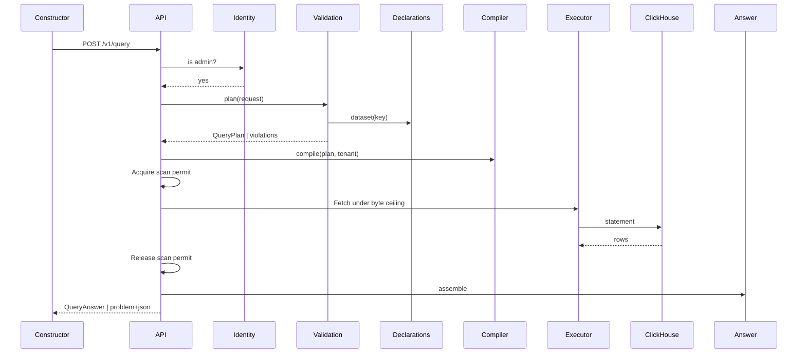

# Technical Design — Query Engine

- [ ] `p1` - **ID**: `cpt-insightspec-qe-design-query-engine`

<!-- toc -->

- [1. Architecture Overview](#1-architecture-overview)
  - [1.1 Architectural Vision](#11-architectural-vision)
  - [1.2 Architecture Drivers](#12-architecture-drivers)
  - [1.3 Architecture Layers](#13-architecture-layers)
- [2. Principles & Constraints](#2-principles--constraints)
  - [2.1 Design Principles](#21-design-principles)
  - [2.2 Constraints](#22-constraints)
- [3. Technical Architecture](#3-technical-architecture)
  - [3.1 Domain Model](#31-domain-model)
  - [3.2 Component Model](#32-component-model)
  - [3.3 API Contracts](#33-api-contracts)
  - [3.4 Internal Dependencies](#34-internal-dependencies)
  - [3.5 External Dependencies](#35-external-dependencies)
  - [3.6 Interactions & Sequences](#36-interactions--sequences)
  - [3.7 Database schemas & tables](#37-database-schemas--tables)
  - [3.8 Deployment Topology](#38-deployment-topology)
- [4. Additional context](#4-additional-context)
  - [Capability status and proposed semantics](#capability-status-and-proposed-semantics)
  - [Saved queries (specified, not implemented)](#saved-queries-specified-not-implemented)
  - [Non-goals](#non-goals)
- [5. Traceability](#5-traceability)

<!-- /toc -->

## 1. Architecture Overview

### 1.1 Architectural Vision

The engine validates a structured request against a dataset declaration, compiles one
parameterized ClickHouse query, and returns a typed table. The compiler applies session
tenancy, dataset read discipline, null-preserving aggregation, UTC boundaries, ordering,
and row limits. The executor bounds fetched bytes, timeout, and concurrent scans.

Validation, compilation, and answer assembly are pure domain operations. The API handles
authorization and orchestration; infrastructure executes the query. Dataset declarations
and their snapshot validation belong to the [dataset registry](../datasets/DESIGN.md).

**Implemented**: single-dataset queries, basic and pattern filters, dimension and time
grouping, conditional count/sum/avg/min/max, ordering, truncation, and administrator access.

**Planned**: constructor UI, advanced query operations, saved queries, and access policies.
Section 3 defines the supported contract; Section 4 preserves proposed extension semantics.
See [PRD.md](PRD.md) for requirements and [MIGRATION.md](MIGRATION.md) for migration.

### 1.2 Architecture Drivers

**ADRs**: none. Access-policy design remains open.

#### Functional Drivers

| Requirement | Design Response |
|-------------|------------------|
| `cpt-insightspec-qe-fr-ask` | request → plan → compile → one scan; no metric definition in the path |
| `cpt-insightspec-qe-fr-group` | a labelled dimension answers `<field>_label` beside its value; grouping restricted to declared dimensions |
| `cpt-insightspec-qe-fr-filter` | tagged filter variants; patterns bound as parameters, `match` compiled at validation; operator/target mismatch refused |
| `cpt-insightspec-qe-fr-fold` | `OrNull` aggregates; `count` alone reports 0 |
| `cpt-insightspec-qe-fr-bounds` | window cap; `LIMIT limit + 1` with `flags.truncated`; chunked byte ceiling; semaphore |
| `cpt-insightspec-qe-fr-refusal` | semantic violations collected after dataset resolution; deserialization fails separately |
| `cpt-insightspec-qe-fr-boolean` | planned: `any`/`all`/`not` variants → parenthesised predicates |
| `cpt-insightspec-qe-fr-relative-window` | planned: resolved at plan time; answer reports `resolved_window` |
| `cpt-insightspec-qe-fr-derived` | planned: `classify` → one `multiIf`; `time_part` → date-part function in the query zone |
| `cpt-insightspec-qe-fr-richer-folds` | planned: advanced aggregates and window operations over the same plan (§4) |
| `cpt-insightspec-qe-fr-time-intelligence` | planned: zone, week start, fiscal start as compiler inputs to every boundary |
| `cpt-insightspec-qe-fr-rows` | planned: row-level results keyed on `row_identity`; route remains undecided |
| `cpt-insightspec-qe-fr-saved` | planned: stored request re-planned on every read |
| `cpt-insightspec-qe-fr-cross-dataset` | planned: one scan per dataset aligned on conformed dimensions; lookups joined on a unique key |
| `cpt-insightspec-qe-fr-funnels` | planned: aggregate families over ClickHouse `windowFunnel`, `retention` |
| `cpt-insightspec-qe-fr-admin-gate` | `require_admin` before every query and discovery handler |
| `cpt-insightspec-qe-fr-access-policies` | planned: policy predicates bound from the caller context at plan time, before any capability |

#### NFR Allocation

| NFR ID | NFR Summary | Allocated To | Design Response | Verification Approach |
|--------|-------------|--------------|-----------------|----------------------|
| `cpt-insightspec-qe-nfr-correctness` | consistent query semantics | compiler | tenancy predicate first; `FINAL` per read discipline; `OrNull` aggregates; `toDate(x, 'UTC')` | rendered-SQL goldens; stand reconciliations |
| `cpt-insightspec-qe-nfr-bounded` | bounded cost | validation, executor, handler | 731-day window; 10 000 rows; 16 MiB chunked ceiling; 8-permit semaphore → 429 | unit tests per cap; stand 400/429 cases |
| `cpt-insightspec-qe-nfr-latency` | interactive latency | gold datasets, compiler | flat pre-joined relations; one scan; partitioned by month, sorted by tenant | planned benchmark; reference workload not yet defined |
| `cpt-insightspec-qe-nfr-contract` | stable contract | contract DTOs | tagged unions with `deny_unknown_fields`; OpenAPI generated from types; CI drift gate | drift check; stand schema generation |
| `cpt-insightspec-qe-nfr-person-data` | personal-data handling | declarations, executor | admin gate and no result store; classification and policies planned | authorization tests; inspect persistence boundaries |

### 1.3 Architecture Layers

```text
constructor ──HTTP──▶ gateway ──▶ analytics service
                                   ├─ api     gate · extract · respond
                                   ├─ domain  declarations · validation · compile · answer
                                   └─ infra   bounded fetch · metrics ──▶ ClickHouse gold
ingestion (dbt) ─────────────────────────────────────────────────────▶ ClickHouse gold
```

- [ ] `p3` - **ID**: `cpt-insightspec-qe-tech-layers`

| Layer | Responsibility | Technology |
|-------|---------------|------------|
| Presentation | constructor: form → request; answer → table and chart | React, TanStack Query |
| Application | handlers: admin gate, extraction, error envelopes | Rust, axum, canonical errors |
| Domain | declarations, validation, compilation, answer assembly | Rust, pure functions |
| Infrastructure | bounded ClickHouse fetch, metrics, identity client | Rust, clickhouse client |
| Data | gold datasets from silver class relations | dbt, ClickHouse MergeTree |

## 2. Principles & Constraints

### 2.1 Design Principles

#### Structured query contract

- [ ] `p1` - **ID**: `cpt-insightspec-qe-principle-contract`

Callers select typed operations over declared fields. SQL identifiers are resolved from the
plan; caller values are bound as parameters. Requests cannot override tenant scoping or
read discipline.

#### Declared fields

- [ ] `p1` - **ID**: `cpt-insightspec-qe-principle-declarations`

Requests may reference only fields exposed by the selected dataset. Shipped declarations
are validated against an embedded column snapshot; this is not a live-schema check.

#### Structured validation errors

- [ ] `p1` - **ID**: `cpt-insightspec-qe-principle-refusals`

After deserialization and dataset resolution, validation collects independent semantic
violations with field paths, reason codes, and available choices. Malformed requests and
unknown datasets fail earlier. Unusable declarations and warehouse failures are server errors.

#### Shared compiler rules

- [ ] `p1` - **ID**: `cpt-insightspec-qe-principle-correctness`

Compiler tests verify tenant predicates, read discipline, aggregate null behavior, and
time boundaries. Prepared-data deduplication and attribution remain dataset responsibilities.

### 2.2 Constraints

#### Session tenant

- [ ] `p1` - **ID**: `cpt-insightspec-qe-constraint-tenancy`

First predicate of every scan is the tenant from the security context. No request member
names a tenant; unknown members are refused.

#### Initial administrator restriction

- [ ] `p1` - **ID**: `cpt-insightspec-qe-constraint-admin-gate`

Datasets carry person columns and declare no access policy yet: `POST /v1/query` and both
`GET /v1/datasets` routes refuse non-administrators. The change declaring the first policy
must specify what replaces the minimum-peer suppression of the metric surfaces.

#### Execution limits

- [ ] `p1` - **ID**: `cpt-insightspec-qe-constraint-bounds`

| Limit | Value |
|---|---|
| Inclusive time window | 731 days, within the supported `Date` range |
| Result rows | Default 1,000; maximum 10,000; fetch one extra to detect truncation |
| Fetched response bytes | 16 MiB, checked while receiving chunks |
| Concurrent scans | Eight per process |
| Permit acquisition | Two seconds, then a retryable capacity error |
| Top-level filters / values per membership filter | 32 / 256 |
| Aggregates / grouping axes / ordering terms | 16 / 4 / 4 |
| Aggregate-name / pattern length | 64 / 256 characters |

Constants live in `contract/dto.rs`, `api/query.rs`, and `infra/query.rs`. The byte cap applies
to fetched warehouse data, not the size of the final serialized HTTP response.

#### Gold relations only

- [ ] `p1` - **ID**: `cpt-insightspec-qe-constraint-gold-only`

A declaration binds an `insight.*` relation whose columns exist in the embedded snapshot. No
bronze, no silver, no query-time joins beyond a future declared lookup, no writes.

#### Security and operations dispositions

- [ ] `p2` - **ID**: `cpt-insightspec-qe-constraint-inherited-platform`

- **Authentication**: gateway and identity establish the session; the engine trusts the
  `SecurityContext` it receives and never authenticates.
- **Data protection**: TLS and tenant isolation inherited from the platform; personal-field
  classification and column masking are planned with access policies.
- **Threats**: injection via operands — mitigated by binding every caller value; over-broad
  exposure before policies — mitigated by the admin gate; resource exhaustion — mitigated by
  the caps above; malformed regex — compiled at validation.
- **Audit**: latency and error class recorded per query; caller/query audit remains open
  and tracked under access policies.
- **Capacity and recovery**: no durable query state. In-process concurrency is bounded;
  warehouse capacity and query shape still affect latency. Recovery follows the service.

## 3. Technical Architecture

### 3.1 Domain Model

**Technology**: Rust types, YAML dataset declarations, JSON column snapshot.

**Location**: `src/backend/services/analytics/src/domain/query/`

**Core Entities**:

| Entity | Description | Schema |
|--------|-------------|--------|
| Dataset | a declaration read from the registry: grain, dimensions with labels, measurables, time fields, read discipline — see the [dataset design](../datasets/DESIGN.md) | `domain/datasets/declaration.rs` |
| QueryRequest | tagged request document | `contract/dto.rs` |
| QueryPlan | request bound to its dataset; answer columns with sources | `plan.rs` |
| CompiledQuery | statement text and positional bindings | `compile/mod.rs` |
| QueryAnswer | typed columns, rows, flags | `contract/dto.rs`, `answer.rs` |
| Violation | field, machine reason, sentence | `violation.rs` |

**Relationships**:
- Dataset: owned by the registry; the engine only reads it.
- QueryRequest → QueryPlan: `validation::plan` binds or refuses.
- QueryPlan → CompiledQuery: `compile` renders.
- CompiledQuery → QueryAnswer: executor returns rows; `answer::assemble` maps aliases.

### 3.2 Component Model

```text
request ─▶ api (gate) ─▶ validation ─▶ compile ─▶ executor ─▶ ClickHouse
                            │                        │
                    dataset registry               answer ─▶ response
                     (its own design)
```

#### Validation

- [ ] `p1` - **ID**: `cpt-insightspec-qe-component-validation`

##### Why this component exists

Resolves field references and checks operations before SQL compilation.

##### Responsibility scope

Bind filters, axes, aggregates, order, window to the declaration; check operand types and
operator/target pairs; compile `match` patterns; enforce caps; build answer columns (value,
label, bucket, aggregate) with sources; return a `QueryPlan` or collected `Violation` values.

##### Responsibility boundaries

No SQL, no connection. `PlanError` separates a refused request from unusable declarations.

##### Related components (by ID)

- `cpt-insightspec-ds-component-registry` — reads declarations from
- `cpt-insightspec-qe-component-compiler` — hands the plan to

#### Compiler

- [ ] `p1` - **ID**: `cpt-insightspec-qe-component-compiler`

##### Why this component exists

Compiles validated plans with consistent query semantics.

##### Responsibility scope

Render one statement: positional aliases; `FINAL` per read discipline; `OrNull` aggregates;
`toDate(x, 'UTC')`; dimension values via `toString` and the absent sentinel; every caller
value as `?`; tenancy, window, filters in that order; `GROUP BY` group columns;
deterministic `ORDER BY`; `LIMIT limit + 1`.

##### Responsibility boundaries

Never sees a raw request or a connection; no authorization logic.

##### Related components (by ID)

- `cpt-insightspec-qe-component-validation` — consumes its plan
- `cpt-insightspec-qe-component-executor` — hands the statement to

#### Executor and answer

- [ ] `p1` - **ID**: `cpt-insightspec-qe-component-executor`

##### Why this component exists

Centralizes warehouse execution and bounded response collection.

##### Responsibility scope

Bind parameters; run under a fetch timeout; collect chunks against the byte ceiling; decode
off the async runtime; record latency and error class. `answer::assemble` maps aliases to
columns, drops the extra row, sets `flags.truncated`.

##### Responsibility boundaries

Does not interpret the request; a ceiling breach is a typed error the handler maps.

##### Related components (by ID)

- `cpt-insightspec-qe-component-compiler` — depends on
- `cpt-insightspec-qe-component-api` — called by

#### API

- [ ] `p1` - **ID**: `cpt-insightspec-qe-component-api`

##### Why this component exists

Exposes query execution through the analytics API.

##### Responsibility scope

`POST /v1/query`: authorize, plan, compile, acquire a permit, fetch, release the permit,
and assemble the result. Section 3.3 defines errors. Dataset discovery is owned by the
datasets API; the query contract supplies its limits metadata.

##### Responsibility boundaries

No business logic, no SQL.

##### Related components (by ID)

- `cpt-insightspec-qe-component-validation` — calls
- `cpt-insightspec-qe-component-executor` — calls
- `cpt-insightspec-qe-component-constructor` — serves

#### Constructor page (planned)

- [ ] `p2` - **ID**: `cpt-insightspec-qe-component-constructor`

##### Why this component exists

Provides query composition and result rendering for administrators.

##### Responsibility scope

Read descriptions; keep a form draft; build the request (measurable operands as numbers,
dimension operands and patterns as text); run; render table and chart; show each violation
beside its input and the truncation flag.

##### Responsibility boundaries

Uses dataset metadata and query errors; owns no metric semantics or persistence.
Not implemented in this change.

##### Related components (by ID)

- `cpt-insightspec-qe-component-api` — calls

#### Access policies (needs design)

- [ ] `p2` - **ID**: `cpt-insightspec-qe-component-access-policies`

##### Why this component exists

Extends administrator-only access with dataset, row, and column policies.

##### Responsibility scope

Per dataset: dataset access (roles or allow list); row policies (dimension bound to a caller
attribute: visible people, team repositories); column policies (dropped or masked per role).
Proposed enforcement occurs at plan time. Section 4 records unresolved decisions.

##### Responsibility boundaries

Never decides who the caller is; refuses when a needed fact is missing.

##### Related components (by ID)

- `cpt-insightspec-qe-component-validation` — extends the plan
- `cpt-insightspec-ds-component-declarations` — policies are declared beside the dataset

### 3.3 API Contracts

- [ ] `p1` - **ID**: `cpt-insightspec-qe-interface-query-api`

- **Contracts**: `cpt-insightspec-qe-contract-caller-context`
- **PRD interface**: `cpt-insightspec-qe-interface-query`
- **Technology**: REST/OpenAPI, JSON, RFC 9457 problem envelopes
- **Location**: [openapi.json](../../components/backend/analytics/openapi.json) — the
  authority for the supported wire schema

**Endpoints Overview**:

| Method | Path | Description | Stability |
|--------|------|-------------|-----------|
| `POST` | `/v1/query` | Execute a query over one dataset | unstable (admin-only) |

Discovery — `GET /v1/datasets` — belongs to the [dataset registry](../datasets/DESIGN.md);
the engine contributes only the request bounds each description carries.

#### Supported request

| Member | Contract |
|---|---|
| `dataset` | One registered dataset key |
| `filters` | Optional list, combined with AND |
| `group_by` | Optional dimension or time axes |
| `aggregates` | One or more named count, sum, avg, min, or max operations; each may have one filter |
| `time` | Required inclusive `from` and `to`; optional declared `field` and day/week/month `grain` |
| `order` | Optional result-column names with ascending or descending direction |
| `limit` | Optional row limit, subject to declared bounds |

`op`, `axis`, and `fn` select tagged variants. Unknown members and operands belonging to
another variant are rejected during deserialization. The OpenAPI document is the complete
wire schema; semantic validation additionally checks dataset fields, types, and limits.

#### Supported operations

- Filters: `eq`, `in`, `gt`, `gte`, `lt`, `lte`, `between`, `not_null`, `like`, `match`.
- Dimensions compare as their string result values. Ordered comparisons require measurables;
  pattern filters require dimensions. Membership lists must be non-empty.
- `like` uses `%` and `_`; `match` uses unanchored RE2 patterns validated before execution.
  Both are case-sensitive; a case-insensitive request option is planned.
- `count` counts rows without a field. Other aggregates require a measurable and preserve null
  for no observations. Conditional aggregates treat an unknown predicate as a non-match.
- Time windows use UTC dates and inclusive endpoints. The time field defaults to the dataset
  default. `time.grain` is required with a time axis and rejected without one. Buckets are
  day, Monday-start week, or month. No dense fill is implemented.
- Grouped dimensions with declared labels return a separate `<field>_label` column.
- Ordering defaults to ascending and includes grouping tie-breakers. Fetching `limit + 1`
  detects truncation.

#### Result and errors

Results contain `columns`, positional `rows`, and `flags.truncated`. Current column kinds are
dimension, label, bucket, and aggregate; column types are text, number, and date.
Cursors, freshness metadata, resolved relative
windows, expression columns, and window columns are planned extensions.

| Condition | Response |
|---|---|
| Semantic validation failure | 400 with field paths, reason codes, and explanations |
| Non-administrator | Permission denial |
| Fetched response exceeds byte cap | 400 with an `OUT_OF_RANGE` violation on `limit` |
| Permit acquisition times out | 429 with retry metadata |
| Unusable declarations, fetch failure, or assembly failure | 500 |

Deserialization failures occur before semantic planning and do not use its collected
violation list. A rejected plan performs no warehouse query.

### 3.4 Internal Dependencies

| Dependency Module | Interface Used | Purpose |
|-------------------|----------------|----------|
| identity client | `is_admin` over the forwarded session | admin gate; later the caller context |
| insight-clickhouse | bound query, bytes cursor | executor fetch |
| toolkit canonical errors | resource-scoped builders | violation, permission, quota envelopes |
| toolkit security | `SecurityContext` | the tenant every scan binds |

### 3.5 External Dependencies

#### ClickHouse

| Dependency Module | Interface Used | Purpose |
|-------------------|---------------|---------|
| executor | HTTP query, positional bindings, `JSONEachRow` | runs the scan |
| declarations | embedded column snapshot | validates datasets offline |

### 3.6 Interactions & Sequences

#### Execute a query

**ID**: `cpt-insightspec-qe-seq-answer`

**Use cases**: `cpt-insightspec-qe-usecase-build-chart`, `cpt-insightspec-qe-usecase-own-category`

**Actors**: `cpt-insightspec-qe-actor-admin`, `cpt-insightspec-qe-actor-constructor`



**Description**: semantic validation completes before warehouse execution. The permit covers
fetching and decoding, and is released before answer assembly.

### 3.7 Database schemas & tables

- [ ] `p2` - **ID**: `cpt-insightspec-qe-db-relations`

The engine owns no relation. It scans the one each dataset declares; their schemas, grains
and provenance are in the [dataset design](../datasets/DESIGN.md).

### 3.8 Deployment Topology

Part of the analytics service; no extra deployable. Gold relations are built by the deploy
hook's `dbt run --select tag:gold`.

## 4. Additional context

### Capability status and proposed semantics

**Implemented** capabilities are accepted by the current API. **Specified, not implemented**
capabilities retain their proposed semantics below. **Needs design** identifies unresolved
architecture. Proposed request members are rejected until implemented.

| Capability | Status |
|---|---|
| Filters: `eq`, `in`, comparisons, `between`, `not_null` | implemented |
| Pattern filters: `like`, `match` | implemented |
| Boolean filter groups: `any`, `all`, `not` | specified, not implemented |
| Case-insensitive patterns | specified, not implemented |
| Dimension and time group axes | implemented |
| Date-part axes | specified, not implemented |
| Bins as dimensions | specified, not implemented |
| Derived dimensions (`classify`) | specified, not implemented |
| `count`, `sum`, `avg`, `min`, `max` with a conditional filter | implemented |
| `count_distinct` (exact and approximate), `median`, `quantile`, `stddev` | specified, not implemented |
| Expressions over aggregate names | specified, not implemented |
| Windows: running sum, moving average, rank, delta, percent change | specified, not implemented |
| Share of total | specified, not implemented |
| `having` | specified, not implemented |
| Top groups with remainder | specified, not implemented |
| Dense fill | specified, not implemented |
| Fixed window, UTC, day/week/month grain | implemented |
| Relative windows | specified, not implemented |
| Timezone, week start, to-date, compare windows | specified, not implemented |
| Fiscal calendars | specified, not implemented |
| Grouping sets and totals | specified, not implemented |
| Semi-additive aggregates | specified, not implemented |
| Truncation flag | implemented |
| Cursors | specified, not implemented |
| Rows behind a cell (drilldown shape) | needs design |
| Multiple datasets in one query over conformed dimensions | needs design |
| Runtime-defined datasets | [datasets](../datasets/DESIGN.md) |
| Discovery of what can be asked | [datasets](../datasets/DESIGN.md) |
| Freshness (`data_through`) | specified, not implemented |
| Saved queries | specified, not implemented |
| Access policies: dataset, row, column | needs design |
| Enrichment lookups (customer-declared dimensions) | needs design |
| Funnels and retention | needs design |

#### Post-aggregation filters (specified)

`having` filters groups by aggregate or expression names after aggregation. Unknown targets
produce violations listing available names. Operands remain bound parameters.

#### Boolean filter logic (specified)

Top-level `filters` is an implicit `all`. `any`, `all`, `not` are filter variants: nest
anywhere a filter may appear. Compile to parenthesised predicates, never reordered. Caps:
total filters and nesting depth. Empty groups refused. `case_insensitive` → `ILIKE` or a
case-insensitive regex; default case-sensitive.

#### Aggregate naming and cross-dataset alignment

`count` counts rows without a field; numeric aggregates read a measurable. Names are unique, snake_case,
and also unique against group columns. Cross-dataset alignment is not implemented; proposed
behavior and open decisions appear under *Multiple datasets in one query*.

#### Expressions

Arithmetic over aggregate names: four operations, parentheses, numeric literals, `nullif`.
Parsed to an AST, rendered from the AST; a non-round-tripping string is refused. NULL
propagates; division by zero is NULL via `nullif`.

#### Windows

Over the answer's buckets after aggregation, partitioned by named dimensions: running sum,
moving average with a bounded frame, rank, delta, percent change. Refused over a sparse axis
unless fill is dense. The first bucket's delta is null. Proposed variants are `running_sum`,
`moving_avg`, `rank`, `delta`, and `pct_change`, with `name`, `of`, and partition dimensions
in `over`. Only `moving_avg` accepts a bounded `frame`.

#### Top groups and the remainder

`top` ranks groups by an aggregate within each `per` partition, keeps `n`, and with
`remainder` folds the rest into one row with a declared label. Ties break on the group value.
The remainder's aggregates are computed over the underlying rows or merged states, never
from finalized scalars. `n` is capped.

#### Fill and dense axes

`time.fill: dense` materialises every bucket in the window; each aggregate's `fill` (zero or
null) says what an empty bucket reports. Sparse is the default.

#### Time intelligence

Boundaries in the query's timezone with its week start. `to_date` clips every bucket at the
point the last one reached. `compare.aligned` shifts by whole periods keeping the day count.
`flags.incomplete_period` identifies an incomplete final bucket. Proposed time grains add
quarter and year; `compare.offset` selects period, month, quarter, or year.

Windows are fixed (`from`/`to`) or relative: last N units (optionally including the current
one) or a calendar period (`this`/`previous` unit, `to_date`). Resolved at plan time in the
query zone; the answer reports `resolved_window`. Same span cap. `fiscal_year_start` shifts
quarter and year buckets and periods; tenant settings supply defaults. Proposed members
include `relative.last`, `unit`, `include_current`, or `period` with `to_date`; fixed and
relative windows are mutually exclusive. The proposed timezone default is UTC.

#### Grouping sets and totals

`totals` lists grouping sets; `[]` is the grand total. Total rows carry a marker column and
sort after detail rows, using the proposed `total_marker` column kind.

#### Bins as dimensions

Numeric or temporal field binned by fixed `width`, explicit `edges`, or a `count` of equal
buckets, using `bin_width`, `bin_edges`, or `bin_count` axis variants. A bin is a group axis;
a distribution combines a bin axis with a count.

#### Date parts as axes

`time_part`: hour, day of week, day of month, week of year, month of year, quarter of year,
in the query zone with its week and fiscal start. Ordinary dimension; may sit beside `time`.
Numeric column with a declared label form.

#### Derived dimensions

`classify`: ordered cases (label + filter over one field) plus `else`; first match wins.
One `multiIf`; behaves as a group axis in filters, `top`, totals. Caps: case count, pattern
length. Same `name` twice is a duplicate.

#### Distinct counts

`count_distinct` over a dimension; exact by default, `approx: true` uses HyperLogLog and the
column type says so. Empty group → 0. `median`, `quantile`, `stddev` fold measurables and
return null over no observations; `quantile` takes a `q` parameter.

#### Share of total

`share` window: `of` divided by the partition's sum, 0..1; empty `over` = whole answer. Zero
total → NULL. Composes with `top` (remainder's share is the rest) and grouping sets.

#### Semi-additive aggregates

`per_period` (last, first, min, max) folds inside each period first, then across; seat-day
and headcount shapes.

#### Cursors over grouped answers

An answer past `limit` returns a keyset cursor over its own order, made total with the group
columns. The request carries `cursor`; the response returns `next_cursor`. Cursors are bound
to the query fingerprint; reuse with a different query is rejected.

#### Freshness (specified)

`flags.data_through`: newest event time the scanned relation holds for the tenant.

#### Access policies (needs design)

**Needs design.** Identity supplies the caller context (subject, roles, visible people, team
memberships, tenant settings); the engine enforces declared policies at plan time. Three
kinds: dataset access (roles or allow list); row policy (dimension ← caller attribute, e.g.
`author_email ← visible_people`, `repository ← team_repositories`), applied to every scan
whatever the query selects, refused when the attribute is missing; column policy (dropped or
masked per role). Open: where team-to-resource facts live; replacement for minimum-peer
suppression; how a saved question records the policy it was validated under. Admin-only
until the first policy lands.

#### Enrichment lookups

**Needs design.** Customer relation keyed on a conformed dimension (repository → product,
person → cost centre), declared as a lookup, joined at plan time; its columns become
dimensions on every dataset sharing the key. Non-unique key refused (fan-out); unmatched key
→ absent sentinel. Open: upload/sync path; tenant- vs per-user scope.

#### Funnels and retention

**Needs design.** Aggregate families over datasets declaring an actor key and event time,
backed by `windowFunnel`, `retention`, `sequenceMatch`. Funnel: ordered step filters plus a
window → actors reaching each step. Retention: entry filter, return filter, period. Group by
any dimension. Open: strict vs any-order steps; exposing a step's actor set for drilldown.

#### Rows behind a cell

**Needs design.** Row-level shape over the same dataset, filters and window: declared columns
instead of groups and aggregates, `row_identity` as page key, cursors, sort by any reported
column. Open: mode of `POST /v1/query` or sibling route (preference: sibling); how a cell's
group values become filters.

#### Multiple datasets in one query

**Needs design.** Several datasets with conformed dimensions; one scan each, aligned on shared
axes. Open: declaring conformance; refusing mismatched grains; making fan-out impossible.
Row-level joins stay out.

### Saved queries (specified, not implemented)

A saved query is a named request with a dataset and a version, selected through the proposed
`saved` request member instead of `dataset`. Read re-runs validation; a
dataset change that invalidates it is a refusal naming the field, never a reinterpretation.
On run, a request may *replace* `time`, `order`, `limit`, `cursor`, `top`, `totals`,
`fill`, `compare`; may *append* `filters` (AND-ed); may not touch `dataset`, `group_by`,
`aggregates`, `expressions`, `windows`, `having`. Versioned; the metric library becomes the
shipped set of saved queries.

### Non-goals

- Undeclared joins in the query; joins live in the modeled relation or a declared lookup.
- Pivot, layout, conditional formatting.
- OData or GraphQL as the native contract.
- Chart-type-specific endpoints; a chart the contract cannot feed is a contract gap.
- Path analysis and sessionization.

## 5. Traceability

- **PRD**: [PRD.md](PRD.md)
- **Migration map**: [MIGRATION.md](MIGRATION.md)
- **Contract**: [openapi.json](../../components/backend/analytics/openapi.json)

**Revision 2.2**: separated the supported API from proposed extensions, consolidated query
semantics and limits, and clarified validation, execution, and authorization boundaries.
